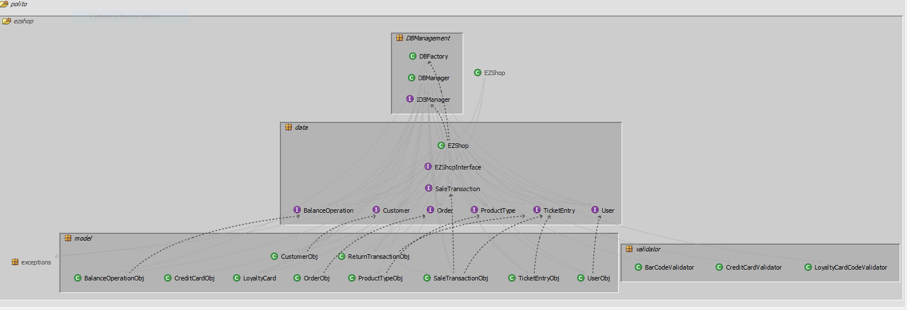
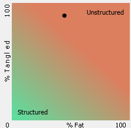
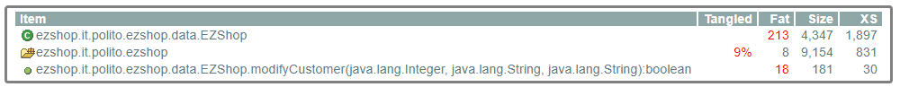
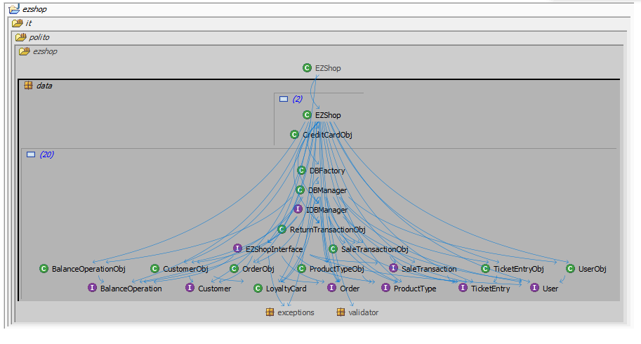
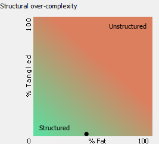

# Design assessment

# Levelized structure map

</img>

# Structural over complexity chart

</img>

# Size metrics

| Metric                                    | Measure |
| ----------------------------------------- | ------- |
| Packages                                  |     8   |
| Classes (outer)                           |    45   |
| Classes (all)                             |    49   |
| NI (number of bytecode instructions)      |   9154  |
| LOC (non comment non blank lines of code) |   3936  |

# Items with XS

</img>

# Package level tangles

</img>

# Summary analysis

The main differences between the initial design delivered and the current one is basically the removal of the package 
.paymentAPI that was created to implement APIs to perform the gateway connection to manage transactions, that at the end was not required in the implementation specifications and the addition of TicketEntry class to manage products inside every transaction that we missed before. Other minor changes were applied on parameters and other methods added to the IDBManager interface that were missing, an extra method in the loyaltyCard class to perform valid codes generation, credit card handling and the removal of some generalization/specification extensions because of conflicts due to constraints given by the declaration of methods in the BalanceOperation and Order interfaces. We solved the last problem removing the extends functionality.

Given structure101 summary and analysis we can see that our implementation code is very tangled and this is due to not so good disposal of classes in the created packages and constraints on the location of interfaces API for the delivery: in fact we saw that moving all our classes inside a single package takes the tangle near 0% with very small repercussions on fatness of the project, even if this is not a great decision to take. On the other hand, the project shows less than a medium fatness situation given by the implementation of EZShop class, that we think in this case can be justifiable because of the Facade role that it owns in the interaction with the GUI.

</img>

</img>

