# Design Document 

Authors: Zhou Chenghan, Alessandro Versace, Alessandro Landra, Ivan Lombardi

Date: 30 Apr 2021

Version: 1.0.1

# Contents

- [High level design](#package-diagram)
- [Low level design](#class-diagram)
- [Verification traceability matrix](#verification-traceability-matrix)
- [Verification sequence diagrams](#verification-sequence-diagrams)

# Instructions

The design must satisfy the Official Requirements document, notably functional and non functional requirements

# High level design 

EZShop application will be developed using a 3-tier layered architecture (GUI - Application Logic - Database) and interacting with the GUI layer using MVC pattern to show data to the user.

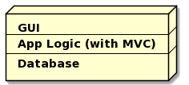

The package diagram shows interactions between packages inside EZShop Java application:
* .gui containing all gui classes
* .model: containing all the data and communication classes
* .data: containing api interfaces to be implemented to communicate with the GUI
* EZShop: is the facade interface implementation that interacts with the GUI (used a Facade design pattern and taken inside .data package)
* .exceptions: containing all throwable exceptions
* .DBManagement: containing all management activities with a local DB
* .validator: containing all classes that manage validation of attributes and results
* .util, .time, .sql: containing data structures, date and sql api classes respectively 
* org.apache.commons.validator.routines.checkdigit.LuhnCheckDigit: containing a validator for the Luhn Algorithm

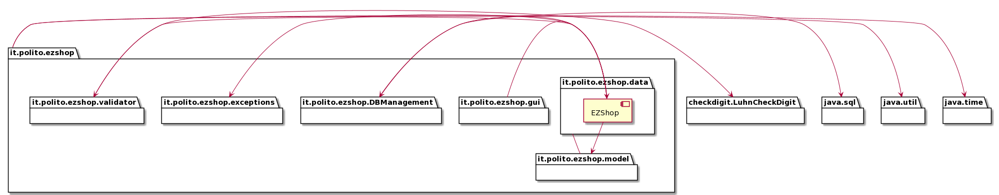

# Low level design

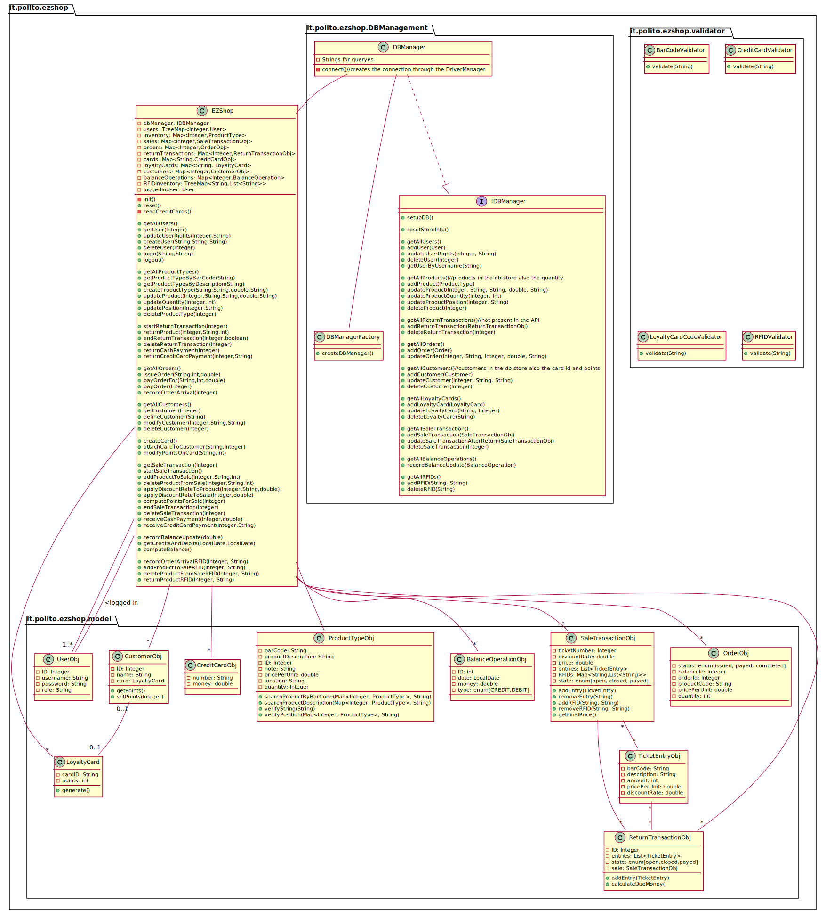

In the previous diagram, all the setters and getters were not explicitely written for sake of graphical semplicity.\
We considered also the Supplier class, adding a Map inside EZShop to keep track of them, as well as the createSupplier, getAllSuppliers and setOrderSupplier methods to be coherent.\
Finally, to follow the FR 4.3, we added the minQuantity attribute in ProductType class and 2 methods in EZShop, that in our view can be added in the API:\
.checkIssueReorderWarning, that can be called after every Sale, passing a Product barCode, to check whether the current quantity is below the minimum or not;\
.reorderWarningConfirm, that should be called after the confirmation of the reorder warning, passing the Product barCode, the Supplier Id and the quantity to be ordered.

Creational pattern used:\
.Abstract Factory, to allow further DB implementation (no sql etc)

# Verification traceability matrix

\<for each functional requirement from the requirement document, list which classes concur to implement it>
|  | EZShop |EZUser|Sale|FinancialTransaction|Order|Customer|ProductType|LoyaltyCard|Position|Supplier|
|:--:|:--:|:--:|:--:|:--:|:--:|:--:|:--:|:--:|:--:|:--:|
|  FR1     | x | x |   |   |   |   |   |   |   |   |
| FR1.1    |   | x |   |   |   |   |   |   |   |   |
| FR1.2    | x |   |   |   |   |   |   |   |   |   |
| FR1.3    | x |   |   |   |   |   |   |   |   |   |
| FR1.4    |   | x |   |   |   |   |   |   |   |   |
| FR1.5    |   | x |   |   |   |   |   |   |   |   |
| FR3      | x |   |   |   | x |   |   |   |   |   |
| FR3.1    | x |   |   |   | x |   |   |   |   |   |
| FR3.2    | x |   |   |   |   |   |   |   |   |   |
| FR3.3    | x |   |   |   |   |   |   |   |   |   |
| FR3.4    |   |   |   |   | x |   |   |   |   |   |
| FR4      | x |   |   |   | x |   | x |   | x |   |
| FR4.1    | x |   |   |   |   |   |   |   |   |   |
| FR4.2    |   |   |   |   |   |   | x |   | x |   |
| FR4.3    | x |   |   |   |   |   |   |   |   |   |
| FR4.4    |   |   |   |   | x |   |   |   |   | x |
| FR4.5    |   |   |   |   | x |   |   |   |   | x |
| FR4.6    |   |   |   |   | x |   |   |   |   |   |
| FR4.7    |   |   |   |   | x |   |   |   |   |   |
| FR 5     | x |   |   |   |   | x |   | x |   |   |
| FR5.1    | x |   |   |   |   |   |   |   |   |   |
| FR5.2    | x |   |   |   |   |   |   |   |   |   |
| FR5.3    | x |   |   |   |   |   |   |   |   |   |
| FR5.4    | x |   |   |   |   |   |   |   |   |   |
| FR5.5    | x |   |   |   |   |   |   |   |   |   |
| FR5.6    |   |   |   |   |   | x |   | x |   |   |
| FR5.7    |   |   |   |   |   | x |   | x |   |   |
| FR6      | x |   | x |   |   |   | x |   |   |   |
| FR6.1    | x |   |   |   |   |   |   |   |   |   |
| FR6.2    |   |   | x |   |   |   |   |   |   |   |
| FR6.3    |   |   | x |   |   |   |   |   |   |   |
| FR6.4    |   |   | x |   |   |   |   |   |   |   |
| FR6.5    |   |   |   |   |   |   | x |   |   |   |
| FR6.6    |   |   | x |   |   |   |   |   |   |   |
| FR6.7    |   |   |   |   |   |   | x |   |   |   |
| FR6.8    | x |   | x |   |   |   |   |   |   |   |
| FR6.9    |   |   | x |   |   |   |   |   |   |   |
| FR6.10   | x |   |   |   |   |   |   |   |   |   |
| FR6.11   | x |   |   |   |   |   |   |   |   |   |
| FR6.12   | x |   |   |   |   |   |   |   |   |   |
| FR6.13   |   |   | x | x |   |   |   |   |   |   |
| FR6.14   | x |   |   |   |   |   |   |   |   |   |
| FR6.15   | x |   |   |   |   |   |   |   |   |   |
| FR7      | x |   | x | x |   |   |   |   |   | x |
| FR7.1    |   |   | x | x |   |   |   |   |   | x |
| FR7.2    | x |   | x | x |   |   |   |   |   | x |
| FR7.3    |   |   | x | x |   |   |   |   |   | x |
| FR7.4    |   |   | x | x |   |   |   |   |   | x |
| FR8      | x |   |   | x |   |   |   |   |   | x |
| FR8.1    |   |   |   | x |   |   |   |   |   |   |
| FR8.2    |   |   |   | x |   |   |   |   |   |   |
| FR8.3    | x |   |   | x | x |   |   |   |   | x |
| FR8.4    |   |   |   | x | x |   |   |   |   | x |

# Verification sequence diagrams 

 

**Scenario 1-1** Create product type X

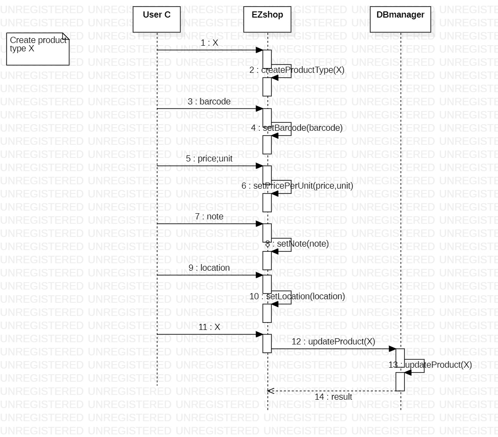</img>

**Scenario 1-2** Modify product type location

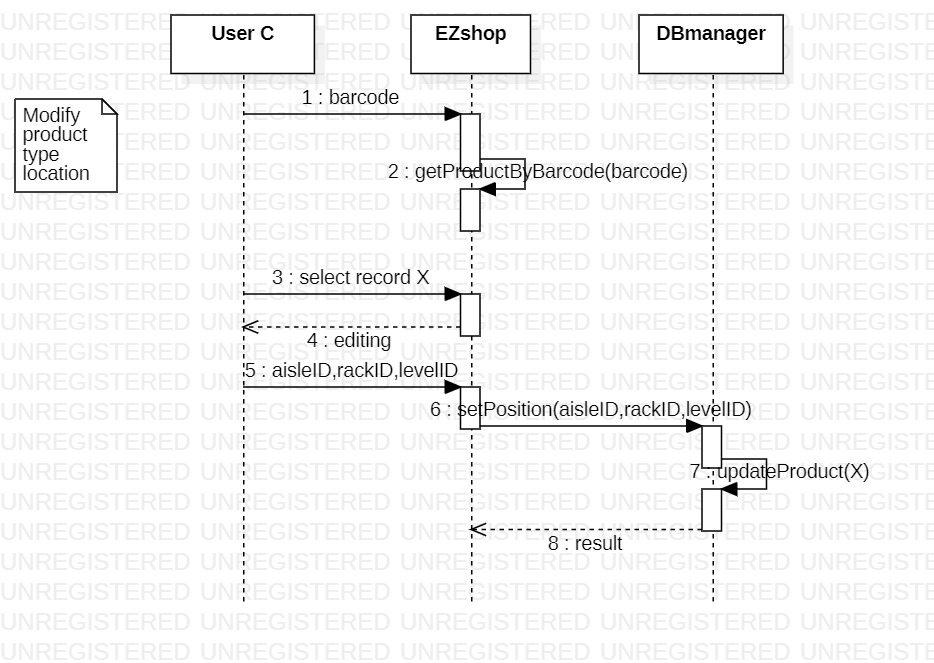</img>

**Scenario 1-3** Modify product type price per unit

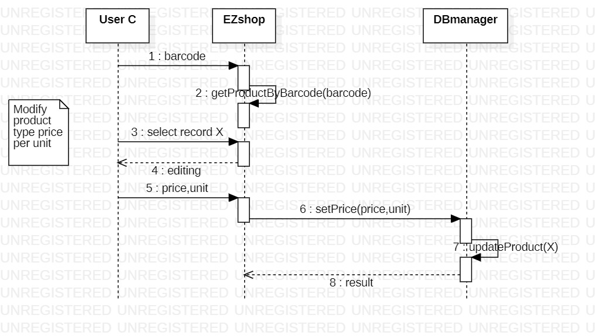</img>

**Scenario 2-1** Create user and define rights

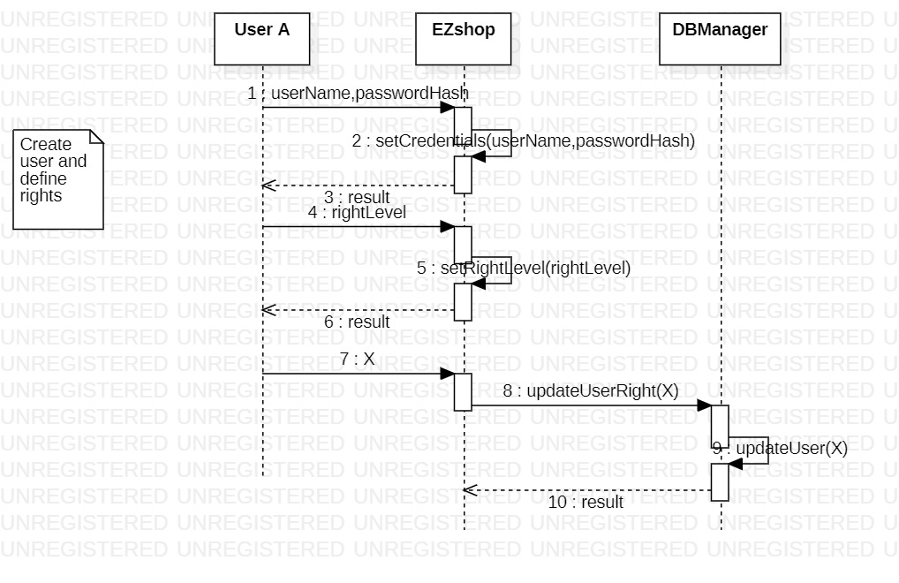</img>

**Scenario 2-2** Delete user

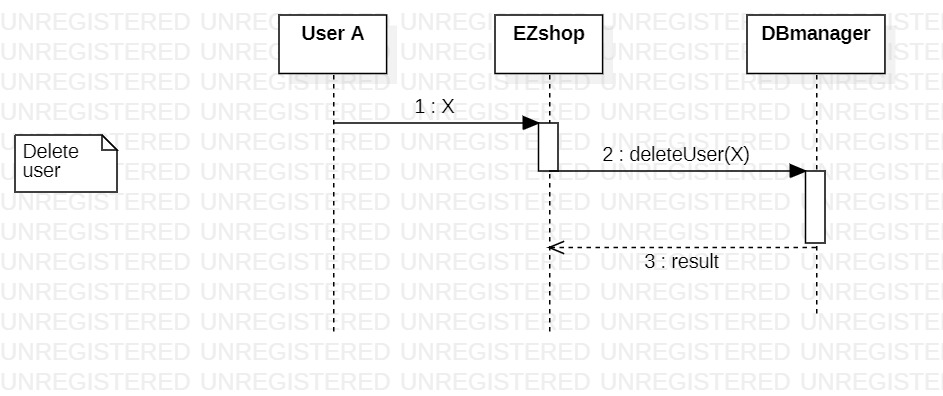</img>

**Scenario 3-3** Record order of product type X arrival

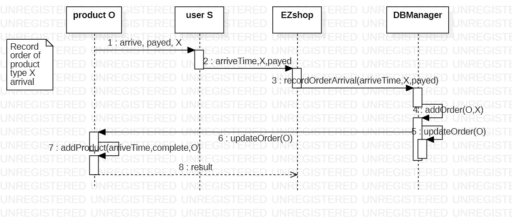</img>

**Scenario 4-2** Attach Loyalty card to customer record

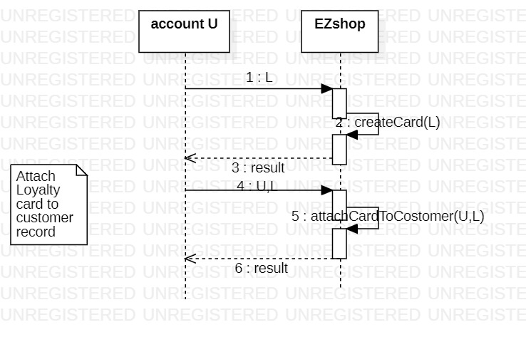</img>

**Scenario 5-1** Login

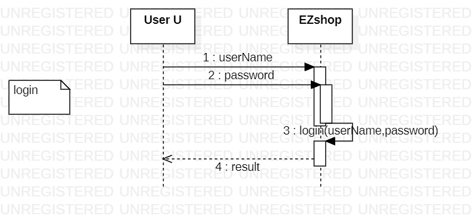</img>

**Scenario 6-2**

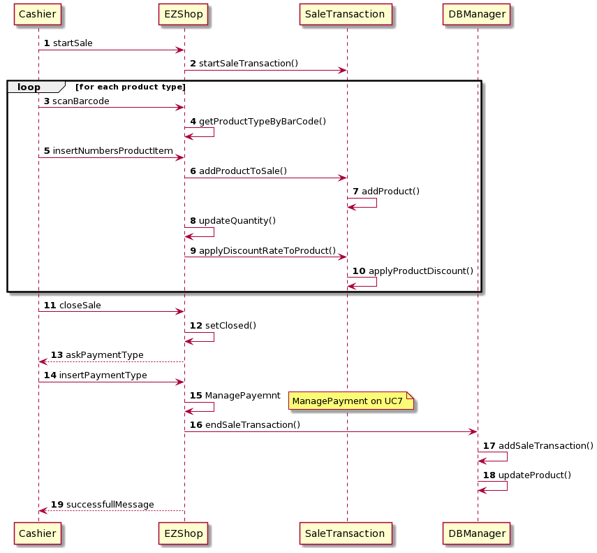

**Scenario 7-1**

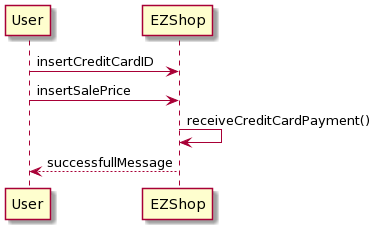

**Scenario 8-1**

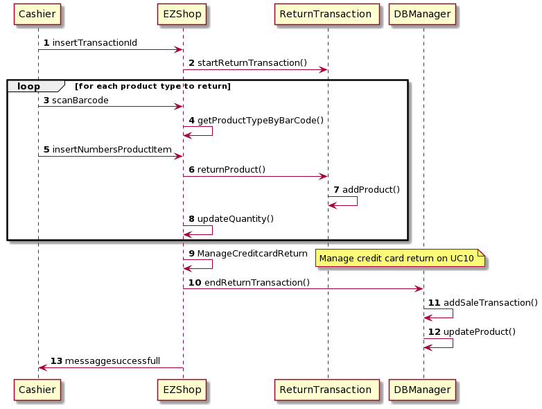

**Scenario 9-1**

**Scenario 10-1**

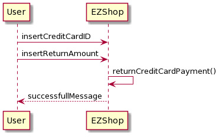

