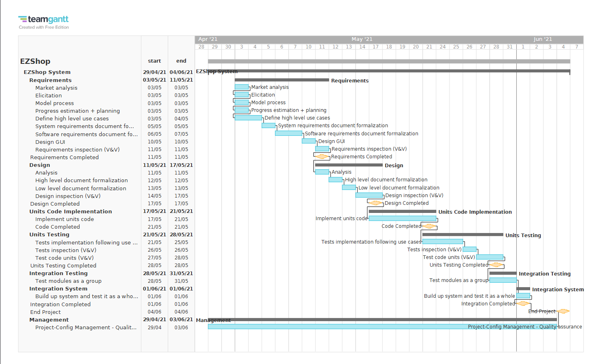

# Project Estimation  
Authors: Zhou Chenghan, Alessandro Versace, Alessandro Landra, Ivan Lombardi

Date: 25 Apr 2021

Version: 1.0
# Contents
- [Estimate by product decomposition]
- [Estimate by activity decomposition ]
# Estimation approach
Our estimations in time and costs are based on Lines Of Code (LOCs) approach and on an activity decomposition. In the first case we are computing an average size per class counting all single lines, without any subtraction of comments, packages, etc. In the second case we computed planned person hours needed on each activity based on realistical distribution for each step of the project plan. What we are not confident about is the estimated calendar time in calendar weeks in the product decomposition, because we see productivity as a little bit high. 
The activity decomposition estimation seems more realitic because we can estimate more deeply each portion of the project and taking in count if parallel work may be possible or not in the Gantt chart. Even if this might be possible during the coding or the testing developing parts, it's very unlikely to be realized during Requirements and Design formalization, expecially using a waterfall approach.
The difference at the end of the two estimations is of about 50ph on the effort and a longer calendar time needed on an activity decomposition approach because of non-parallelizable parts.

# Estimate by product decomposition
### 
|             | Estimate                        |             
| ----------- | ------------------------------- |  
| NC =  Estimated number of classes to be developed   | 26 class |             
|  A = Estimated average size per class, in LOC       | 180 LOCs | 
| S = Estimated size of project, in LOC (= NC * A) | 4680 LOCs |
| E = Estimated effort, in person hours (here use productivity 10 LOC per person hour) | 468 ph |   
| C = Estimated cost, in euro (here use 1 person hour cost = 30 euro) | €14040 | 
| Estimated calendar time, in calendar weeks (Assume team of 4 people, 8 hours per day, 5 days per week ) | 3w (2.9w) |               
# Estimate by activity decomposition
### 
|         Activity name    | Estimated effort (person hours)   |             
| ----------- | ------------------------------- | 
| **Requirements** |  |
| &nbsp;&nbsp;&nbsp;&nbsp;&nbsp; Market analysis | 7 |
| &nbsp;&nbsp;&nbsp;&nbsp;&nbsp; Elicitation | 8 |
| &nbsp;&nbsp;&nbsp;&nbsp;&nbsp; Model process | 6 |
| &nbsp;&nbsp;&nbsp;&nbsp;&nbsp; Progress estimation + planning | 6 |
| &nbsp;&nbsp;&nbsp;&nbsp;&nbsp; Define high level use cases | 4 |
| &nbsp;&nbsp;&nbsp;&nbsp;&nbsp; System requirements document formalization | 25 |
| &nbsp;&nbsp;&nbsp;&nbsp;&nbsp; Software requirements document formalization | 18 |
| &nbsp;&nbsp;&nbsp;&nbsp;&nbsp; Design GUI | 10 |
| &nbsp;&nbsp;&nbsp;&nbsp;&nbsp; Requirements inspection (V & V) | 12 |
| **Design** | |
| &nbsp;&nbsp;&nbsp;&nbsp;&nbsp; Analysis | 4 |
| &nbsp;&nbsp;&nbsp;&nbsp;&nbsp; High level document formalization | 7 |
| &nbsp;&nbsp;&nbsp;&nbsp;&nbsp; Low level document formalization | 16 |
| &nbsp;&nbsp;&nbsp;&nbsp;&nbsp; Design inspection (V & V) | 10 |
| **Units Code Implementation** |  |
| &nbsp;&nbsp;&nbsp;&nbsp;&nbsp; Implement units code | 160 |
| **Units Testing** | |
| &nbsp;&nbsp;&nbsp;&nbsp;&nbsp; Tests implementation following use cases | 75 |
| &nbsp;&nbsp;&nbsp;&nbsp;&nbsp; Tests inspection (V & V) | 12 |
| &nbsp;&nbsp;&nbsp;&nbsp;&nbsp; Test code units (V & V) | 28 |
| **Integration Testing** |  |
| &nbsp;&nbsp;&nbsp;&nbsp;&nbsp; Test modules as a group | 25 |
| **Integration System** |  |
| &nbsp;&nbsp;&nbsp;&nbsp;&nbsp; Build up system and test it as a whole | 25 |
| **Management** |  |
| &nbsp;&nbsp;&nbsp;&nbsp;&nbsp; Project - Configuration management - Quality assurance  | 60 |
###

The Gantt chart shows the Management activity that starts a little bit before the real working process and ends the project after the estimation to include internal project management decisions and post mortem activities that are not paid by the buyers, but aims to improve the team future works. 