# Graphical User Interface Prototype  

Authors: Alessandro Versace, Alessandro Landra, Ivan Lombardi, Zhou Chenghan

Date: 21 Apr 2021

Version: 1.1

1. Login page
This is the page of login. if it's the first time user login users need to change thier password at first

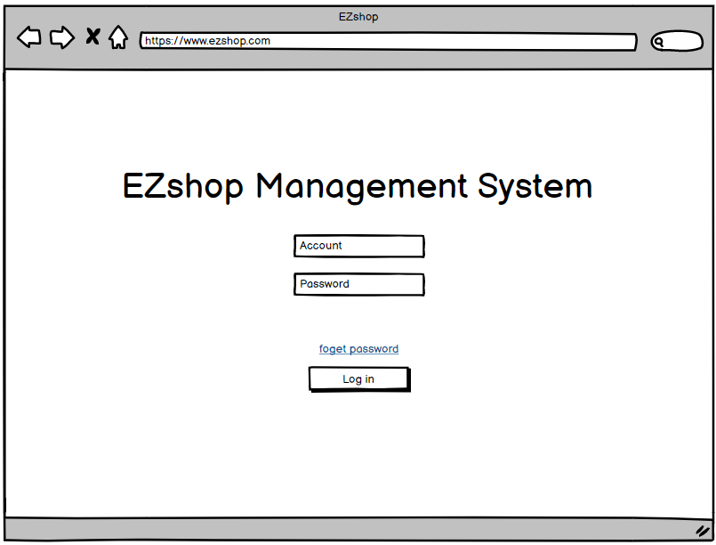</img>

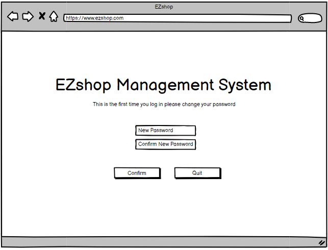</img>

2. After login the system will display different interface to different user.

For Cashier:

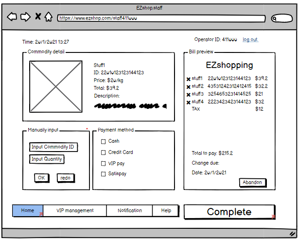</img>

Cashier in the supermarket will use their barcode scancer to scan the products that user want to buy. If the barcode doesn't work, the cashier will manually input the product ID to the box in "Manyally input". In this way the product will be automatically added to the "Bill preview" on the right. If there are any misoperation cashier can also abadon this transaction or delete products have already listed in the receipt.

After finish all the process the cashier will complete the payment with the button "Complete". And the system will give the operator a window to tell the cashier how much money should pay by customer in the transaction and how much should be return back to the customer.

</img>

For Logistic Operator
After the product arrives the supermarket. If this is the first time been recorded to the repository, the logistic operator will upload the picture, barcode and QRcode for each kind of product and so do the information of them. After these operation the new product will be added to the list on the right.

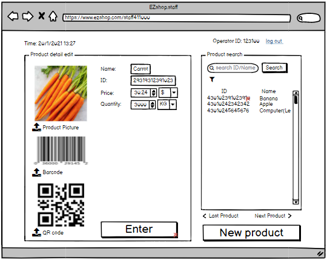</img>

Except that, for the products which have already recorded in the list. The operator can modify the information of each product respectively or delete the information stored in the database.

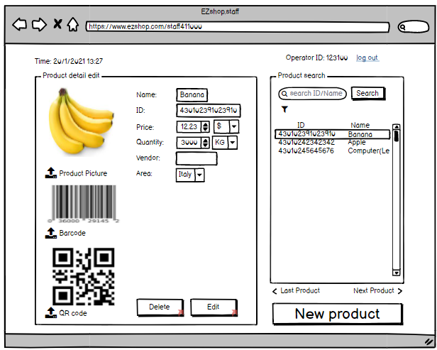</img>

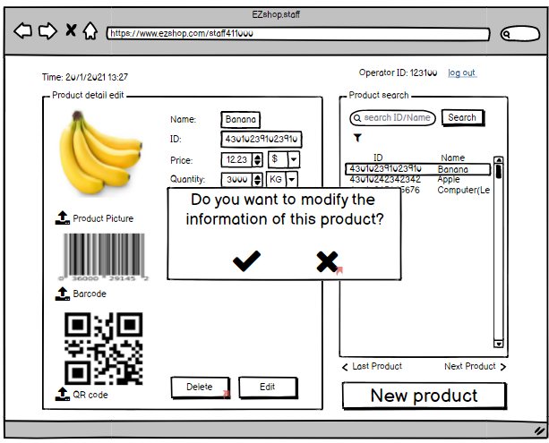</img>

For Administrator
Administrator in the supermarket should have higher view and right than other staff. So the interface of administrator has a tag which is used to select the function they want to use. The function include in the interface are shown below. The "finacial statistics" is used to export the report which is used on the meeting or market analysis. 

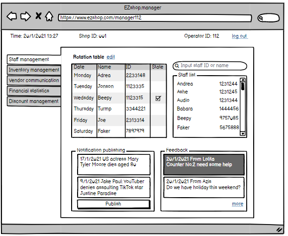</img>

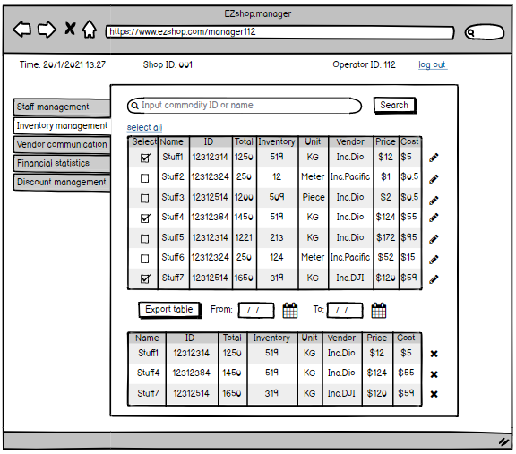</img>

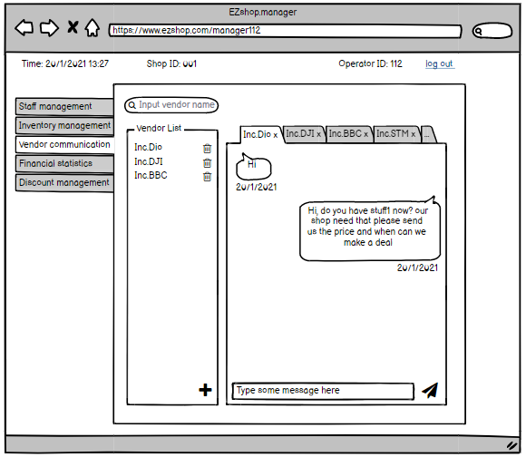</img>

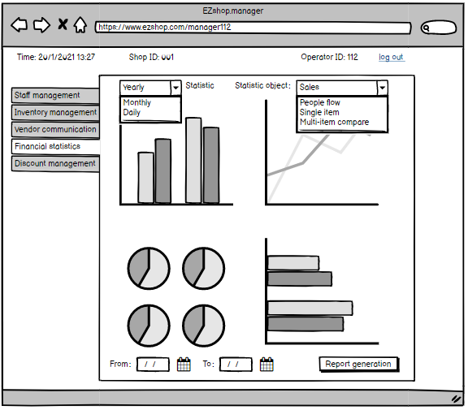</img>

The final function "discount management" gives right to administrator to arrange the saling strategy in their daily work. This system also allows admin to edit the strategy of each kind of product.

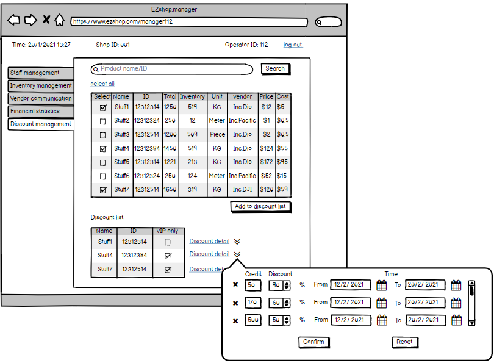</img>

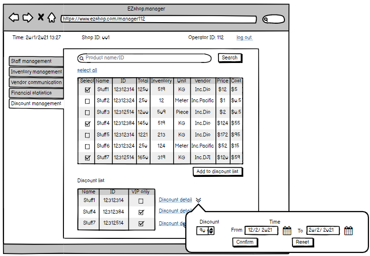</img>
