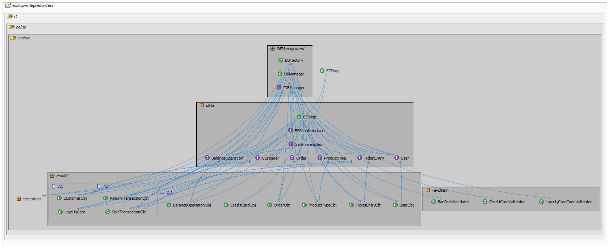

# Integration and API Test Documentation

Authors: Alessandro Versace, Alessandro Landra, Ivan Lombardi, Zhou Chenghan

Date: 26 May 2021

Version: 1.0

# Contents

- [Dependency graph](#dependency graph)

- [Integration approach](#integration)

- [Tests](#tests)

- [Scenarios](#scenarios)

- [Coverage of scenarios and FR](#scenario-coverage)
- [Coverage of non-functional requirements](#nfr-coverage)

# Dependency graph 

    

# Integration approach

We used a bottom up integration approach since we had already completed unit tests, supposing we've already fixed the majority of failures on them. That means we started from test individual units, then proceeded with all the step testing classes and methods integration until the top (EZshop class).

  Step1: Unit Testing (see UnitTestReport.md)

  Step2: First level classes integration

  Step3: Ezshop + all other classes (API testing)

#  Tests

   <define below a table for each integration step. For each integration step report the group of classes under test, and the names of
     JUnit test cases applied to them> JUnit test classes should be here src/test/java/it/polito/ezshop

Below, when referring to the class DBManager, we considered also DBFactory class as covered. All the JUnit tests are present in it.polito.ezshop.acceptanceTests package

## Step 1
| Classes  | JUnit test cases |
|--|--|
|BalanceOperationObj| testBalanceOperationObjsetBalanceId, testBalanceOperationObjsetDate, testBalanceOperationObjsetMoney, testBalanceOperationObjsetType |
|CreditCardObj| testCreditCardObjsetMoney |
|CustomerObj| testCustomerObjsetCustomerName, testCustomerObjsetCustomerCard, testCustomerObjsetId, testCustomerObjsetPoints |
|LoyaltyCard| testLoyaltyCardsetCardId, testLoyaltyCardsetPoints |
|OrderObj| testOrderObjsetBalanceId, testOrderObjsetProductCode, testOrderObjsetPricePerUnit, testOrderObjsetQuantity,  testOrderObjsetStatus, testOrderObjsetOrderId |
|ProductTypeObj| testProductTypeObjsetQuantity, testProductTypeObjsetLocation, testProductTypeObjsetNote,  testProductTypeObjsetProductDescription, testProductTypeObjsetBarCode, testProductTypeObjsetPricePerUnit, testProductTypeObjsetId, testProductTypeObjsearchProductByBarCode, testProductTypeObjsearchProductDescription, testProductTypeObjverifyString, testProductTypeObjverifyPosition |
|TicketEntryObj| testTicketEntryObjsetBarCode, testTicketEntryObjsetProductDescription, testTicketEntryObjsetAmount, testTicketEntryObjsetPricePerUnit, testTicketEntryObjsetDiscountRate |
|UserObj| testUserObjsetId, testUserObjsetUsername, testUserObjsetPassword, testUserObjsetRole, testUserObjverifyUsername |
|BarCodeValidator|testBarCodeValidatorvalidate|
|CreditCardValidator|testCreditCardValidatorvalidate|
|LoyaltyCardCodeValidator|testLoyaltyCardCodeValidatorvalidate|

## Step 2
| Classes  | JUnit test cases |
|--|:-:|
| SaleTransactionObj+TicketEntry | testSaleTransactionObjsetState, testSaleTransactionObjsetStateStr, testSaleTransactionObjsetTicketNumber, testSaleTransactionObjsetDiscountRate, testSaleTransactionObjsetPrice, testSaleTransactionObjGetEntries, testSaleTransactionObjSetEntries, testSaleTransactionObjAddEntry, testSaleTransactionObjRemoveEntry, testSaleTransactionGetFinalPrice |
| ReturnTransactionObj+SaleTransactionObj+TicketEntry | testReturnTransactionObjSetId, testReturnTransactionObjsetState, testReturnTransactionObjsetStateStr, testReturnTransactionObjSetSale, testReturnTransactionObjAddEntry, testReturnTransactionObjCalculateDueMoney |

## Step 3 

| Classes  | JUnit test cases |
|--|--|
| EZShop+UserObj+DBManager | testLogin |
| EZShop+UserObj+ProductTypeObj+SaleTransactionObj+BalanceOperationObj+BarCodeValidator+DBManager | testReset |
| EZShop+UserObj+UserObj+DBManager|testGetUser|
| EZShop+UserObj+UserObj+DBManager|testDeleteUser|
| EZShop+UserObj+CustomerObj+DBManager | testDefineCustomer |
| EZShop+UserObj+CustomerObj+LoyaltyCard+LoyaltyCardCodeValidator+DBManager | testAttachCardToCustomer |
| EZShop+UserObj+CustomerObj+DBManager | testDeleteCustomer |
| EZShop+UserObj+CustomerObj+DBManager| testGetAllCustomer|
| EZShop+UserObj+ProductTypeObj+BarCodeValidator+DBManager |testCreateProductType|
| EZShop+UserObj+ProductTypeObj+DBManager | testDeleteProductType|
| EZShop+UserObj+ProductTypeObj+BarCodeValidator+DBManager | testUpdateProduct |
| EZShop+UserObj+ProductTypeObj+BarCodeValidator+DBManager | testUpdatePosition |
| EZShop+UserObj+ProductTypeObj+BarCodeValidator+DBManager | testGetProductTypesByDescription |
| EZShop+UserObj+ProductTypeObj+OrderObj+BalanceOperationObj+BarCodeValidator+DBManager | testRecordOrderArrival |
| EZShop+UserObj+ProductTypeObj+OrderObj+BalanceOperationObj+BarCodeValidator+DBManager | testPayOrderFor |
| EZShop+UserObj+ProductTypeObj+TicketEntryObj+SaleTransactionObj+ReturnTransactionObj+BarCodeValidator+DBManager | testEndReturnTransaction |
| EZShop+UserObj+ProductTypeObj+TicketEntryObj+SaleTransactionObj+ReturnTransactionObj+BalanceOperationObj+BarCodeValidator+DBManager | testReturnCashPayment |
| EZShop+UserObj+SaleTransactionObj|testStartSaleTransaction|
| EZShop+UserObj+SaleTransactionObj+ProductTypeObj+TicketEntryObj+ProductTypeObj+BarCodeValidator|testAddProductToSale|
| EZShop+UserObj+SaleTransactionObj|testComputePointsForSale|
| EZShop+UserObj+SaleTransactionObj+DBManager+BalanceOperationObj|testReceiveCashPayment|
| EZShop+UserObj+SaleTransactionObj+DBManager+BalanceOperationObj+CreditCardObj|testReceiveCreditCardPayment|
| EZShop+UserObj+ProductTypeObj+SaleTransactionObj+TicketEntryObj+OrderObj+ReturnTransactionObj+BalanceOperationObj+BarCodeValidator+DBManager | testGetCreditsAndDebits |
| EZShop+UserObj+CustomerObj | testGetCustomer |
| EZShop+UserObj+OrderObj | testGetAllOrders |
| EZShop+UserObj+BalanceOperationObj+DBManager | testRecordBalanceUpdate |
| EZShop+UserObj+LoyaltyCard+DBManager | testCreateCard |
| EZShop+UserObj+SaleTransactionObj | testApplyDiscountRateToSale |
| EZShop+UserObj+CustomerObj+DBManager|testModifyPointOnCard|
| EZShop+UserObj+DBManager | testUpdateUserRights |
| EZShop+UserObj+CreditCardValidator+ReturnTransactionObj+CreditCardObj+BalanceOperationObj+DBManager | testReturnCreditCardPayment |
| EZShop+UserObj+CustomerObj+DBManager+LoyaltyCardCodeValidator+LoyaltyCard | testModifyCustomer |
| EZShop+UserObj+SaleTransactionObj | testGetSaleTransaction|
| EZShop+UserObj+SaleTransactionObj+DBManager | testDeleteSaleTransaction |
| EZShop+UserObj+ReturnTransactionObj+ProductType+TicketEntryObj+DBManager | testDeleteReturnTransaction |
| EZShop+UserObj+SaleTransactionObj+ReturnTransactionObj | testStartReturnTransaction |
| EZShop+UserObj+BarCodeValidator+ProductTypeObj | testGetProductTypeByBarCode |
| EZShop+UserObj+BarCodeValidator+OrderObj+DBManager | testIssueOrder |
| EZShop+UserObj+DBManager+ProductTypeObj | testUpdateQuantity |
|EZshop+UserObj+SaleTransactionObj+TicketEntry+ProductTypeObj|testDeleteProductFromSale |
| EZshop+UserObj | testGetAllUsers |
| EZshop+UserObj+OrderObj+DBManager | testPayOrder |
| EZshop+UserObj+BarCodeValidator+ProductTypeObj | testGetAllProductTypes |
| EZshop+DBManager+UserObj | testCreateUser |
| EZshop+SaleTransactionObj+TicketEntry+UserObj | testApplyDiscountRateToProduct |
| EZshop+ReturnTransactionObj+TicketEntryObj+UserObj | testReturnProduct |
| EZshop+SaleTransactionObj+SaleTransactionObj+UserObj | testEndSaleTransaction |
| EZShop+UserObj+BalanceOperationObj+DBManager | testComputeBalance|

# Scenarios

<If needed, define here additional scenarios for the application. Scenarios should be named
 referring the UC in the OfficialRequirements that they detail>

## Scenario UCx.y

| Scenario |  name |
| ------------- |:-------------:|
|  Precondition     |  |
|  Post condition     |   |
| Step#        | Description  |
|  1     |  ... |
|  2     |  ... |

# Coverage of Scenarios and FR

| Scenario ID | Functional Requirements covered | JUnit  Test(s) |
| ----------- | ------------------------------- | ----------- |
| 1-1         | FR3.1                           | testCreateProductType|
|             | FR4.2                           | testUpdatePosition |
| 1-2         | FR3.4                           | testGetProductTypeByBarcode |
|             | FR4.2                           | testUpdatePosition |
| 1-3         | FR3.4                           | testGetProductTypeByBarcode |
|             | FR3.1                           | testUpdateProduct |
| 2-1         | FR1.1                           | testCreateUser |
| 2-2         | FR1.2                           | testDeleteUser |
| 2-3         | FR1.5                           | testUpdateUserRights |
|             | FR1.3                           | testGetAllUsers |
|             | FR1.4                           | testGetUser |
| 3-1         | FR4.4                           | testIssueOrder |
| 3-2         | FR4.5                           | testPayOrder |
| 3-3         | FR4.6                           | testRecordOrderArrival |
| -           | FR4.7                           | testGetAllOrders |
|             | FR4.1                           | testUpdateQuantity |
| 4-1         | FR5.1                           | testDefineCustomer |
| 4-2         | FR5.5                           | testCreateCard |
|             | FR5.6                           | testAttachCardToCustomer |
| 4-3         | FR5.1                           | testModifyCustomer |
| 4-4         | FR5.1                           | testModifyCustomer |
| -           | FR5.3                           | testGetCustomer |
| -           | FR5.4                           | testGetAllCustomers |
| 5-1         | FR1.5                           | testLogin |
| 5-2         | FR1.5                           | testLogout |
| 6-1         | FR6.1                           | testStartSaleTransaction |
|             | FR6.7                           | testProductTypeObjSearchProductByBarCode |
|             | FR6.2                           | testAddProductToSale|
|             | FR7.3,FR7.4                     | (see UC7) |
|             | FR6.10                          | testEndSaleTransaction |
|             | FR6.11                          | testEndSaleTransaction |
| 6-2         | FR6.1                           | testStartSaleTransaction |
|             | FR6.5                           | testApplyDiscountRateToProduct |
|             | FR6.7                           | testProductTypeObjSearchProductByBarCode |
|             | FR6.2                           | testAddProductToSale |
|             | FR6.6                           | testApplyDiscountRateToSale |
|             | FR7.3,FR7.4                     | (see UC7) |
|             | FR6.10                          | testEndSaleTransaction |
|             | FR6.11                          | testEndSaleTransaction |
| 6-3         | FR6.1                           | testStartSaleTransaction |
|             | FR6.7                           | testProductTypeObjSearchProductByBarCode |
|             | FR6.2                           | testAddProductToSale|
|             | FR6.10                          | testEndSaleTransaction|
|             | FR6.4                           | testApplyDiscountRateToSale|
|             | FR7.1, FR7.3                    | testReceiveCashPayment|
|             | FR7.2, FR7.4                    | testReceiveCreditCardPayment|
|             | FR8.4                           | testComputeBalance|
|             | FR6.13                          | testSaleTransactionObjSetTicketNumber|
| 6-4         | FR6.1                           | testStartSaleTransaction |
|             | FR6.7                           | testProductTypeObjSearchProductByBarCode |
|             | FR6.2                           | testAddProductToSale |
|             | FR6.10                          | testEndSaleTransaction |
|             | FR7.1                           | testReceiveCashPayment|
|             | FR7.2                           | testReceiveCreditCardPayment|
|             | FR6.6, FR5.7                    | testComputePointForSale|
|             | FR8.1, FR8.2                    | testGetCreditsAndDebits|
|             | FR8.4                           | testComputeBalance|
|             | FR6.13                          | testSaleTransactionObjSetTicketNumber|
| 6-5         | FR6.1                           | testStartSaleTransaction |
|             | FR6.2                           | testAddProductToSale |
|             | FR6.3                           | testDeleteProductFromSale |
|             | FR6.10                          | testEndSaleTransaction |
|             | FR6.11                          | testEndSaleTransaction |
| 6-6         | FR6.1                           | testStartSaleTransaction |
|             | FR6.7                           | testProductTypeObjSearchProductByBarCode |
|             | FR6.2                           | testAddProductToSale |
|             | FR6.3                           | testDeleteProductFromSale |
|             | FR6.10                          | testEndSaleTransaction |
|             | FR7.1                           | testReceiveCashPayment|
|             | FR6.6                           | testComputePointForSale|
|             | FR8.1, FR8.2                    | testGetCreditsAndDebits|
|             | FR8.4                           | testComputeBalance|
|             | FR6.13                          | testSaleTransactionObjSetTicketNumber|
| 7-1         | FR7.2                           | testReceiveCreditCardPayment|
| 7-2         | FR7.2                           | testReceiveCreditCardPayment|
| 7-3         | FR7.2                           | testReceiveCreditCardPayment|
| 7-4         | FR7.1                           | testReceiveCashPayment |
| 8-1         | FR6.12                          | testStartReturnTransaction |
|             | FR6.7                           | testProductTypeObjSearchProductByBarCode |
|             | FR6.13                          | testReturnProduct |
|             | FR7.4                           | (see UC10-1) |
|             | FR6.14,FR6.15                   | testEndReturnTransaction |
| 8-2         | FR6.12                          | testStartReturnTransaction |
|             | FR6.7                           | testProductTypeObjSearchProductByBarCode |
|             | FR6.13                          | testReturnProduct |
|             | FR7.3                           | (see UC10-2) |
|             | FR6.14,FR6.15                   | testEndReturnTransaction |
| 9-1         | FR8.3                           | testGetCreditsAndDebits |
| 10-1        | FR7.4                           | testReturnCreditCardPayment |
| 10-2        | FR7.3                           | testReturnCashPayment |
|             | FR6.15                          | testDeleteReturnTransaction |
|             | FR 8.1 - 8.2                    | testRecordBalanceUpdate |
| -           | FR3.3                           | testGetAllProductTypes |
| -           | FR3.4                           | testGetProductTypesByDescription |
| -           | FR3.2                           | testDeleteProductType |
| -           | FR4.3                           | removed from FR |
| -           | FR5.2                           | testDeleteCustomer |
| -           | FR6.8, FR6.9                    | removed from FR |

# Coverage of Non Functional Requirements

| Non Functional Requirement | Test name                                        |
| -------------------------- | ------------------------------------------------ |
| NFR3                       | testEndReturnTransaction, testEndSaleTransaction |
| NFR4                       | testBarCodeValidatorValidate                     |
| NFR5                       | testCreditCardValidatorValidate                  |
| NFR6                       | testLoyaltyCardCodeValidatorValidate             |

