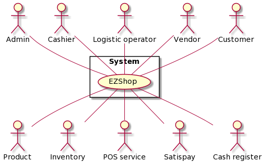
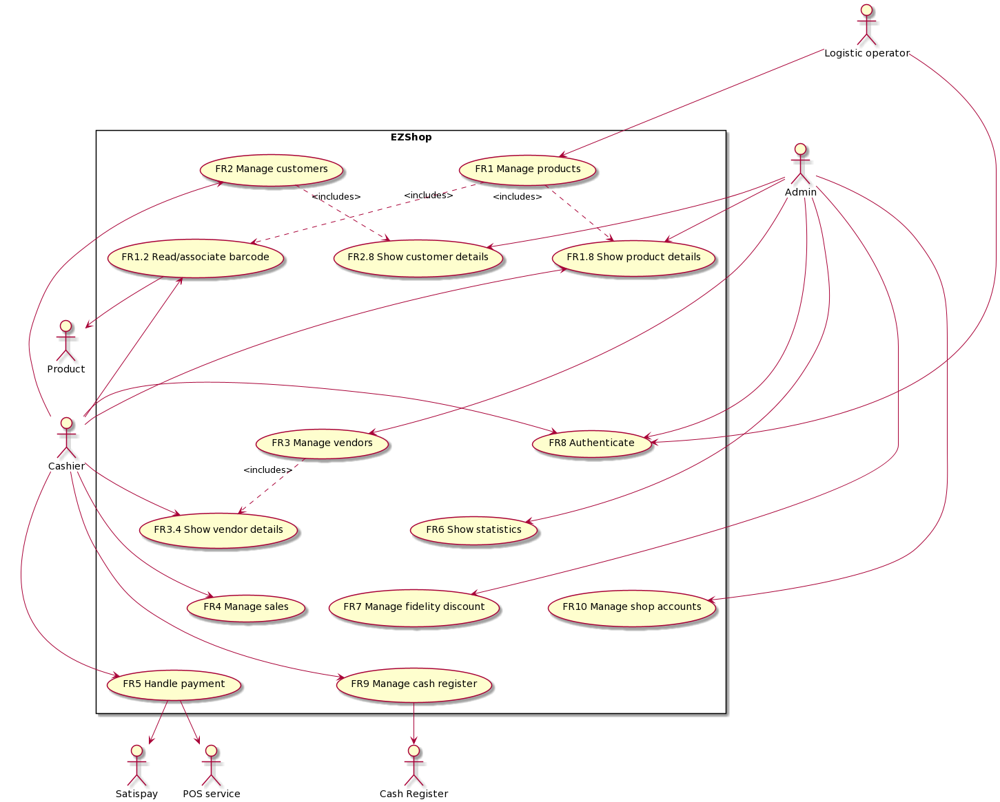
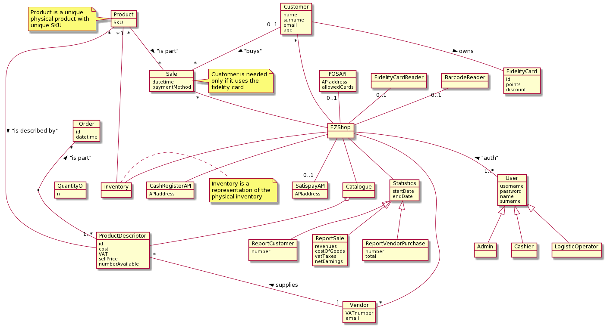
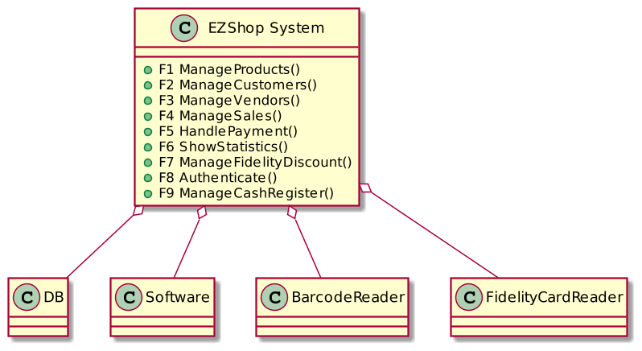
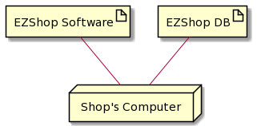

# Requirements Document 

Authors: Zhou Chenghan, Alessandro Versace, Alessandro Landra, Ivan Lombardi

Date: 21 Apr 2021

Version: 1.3

# Contents

- [Essential description](#essential-description)
- [Stakeholders](#stakeholders)
- [Context Diagram and interfaces](#context-diagram-and-interfaces)
	+ [Context Diagram](#context-diagram)
	+ [Interfaces](#interfaces) 
	
- [Stories and personas](#stories-and-personas)
- [Functional and non functional requirements](#functional-and-non-functional-requirements)
	+ [Functional Requirements](#functional-requirements)
	+ [Non functional requirements](#non-functional-requirements)
- [Use case diagram and use cases](#use-case-diagram-and-use-cases)
	+ [Use case diagram](#use-case-diagram)
	+ [Use cases](#use-cases)
    	+ [Relevant scenarios](#relevant-scenarios)
- [Glossary](#glossary)
- [System design](#system-design)
- [Deployment diagram](#deployment-diagram)

# Essential description

Small shops require a simple application to support the owner or manager. A small shop (ex a food shop) occupies 50-200 square meters, sells 500-2000 different item types, has one or a few cash registers 
EZShop is a software application to:
* manage sales
* manage inventory
* manage customers
* support accounting

# Stakeholders

| Stakeholder name      | Description                                                       | 
| --------------------- |:-----------------------------------------------------------------:|
| Admin/buyer           | Shop owner/manager, manages the shop and analyzes its performance | 
| Cashier               | Shop employee who handles payment and registers sales             |
| Logistic operator     | Shop employee who registers the products to be sold               |
| Customer              | Person who buys one or more products                              |
| Product               | Physical item to be sold in the store                             |
| Vendor                | Party in the supply chain that makes goods available to shops     |
| Inventory             | List of product present in the store                              |
| POS service           | Card payment handler                                              |
| Satispay              | Digital payment company                                           |
| Cash register         | Device to store cash and print receipts                           |
| Developer/analyst/DBA | Developer, DBA and analyst (same person due to small project)     |
| Code maintainer       | Developer who maintain the program updated                        |
| HW maintainer         | Technician who setup the system and fixes the broken components   |

# Context Diagram and interfaces

## Context Diagram

## Interfaces

Below, 'device' is intended as laptop or desktop.

| Actor                | Logical Interface      | Physical Interface                                    |
| -------------------- |:----------------------:| -----------------------------------------------------:|
| Admin                | admin GUI              | device connected to the internal DB                   |
| Cashier              | cashier GUI            | device connected to the internal DB and to the router |
| Logistic operator    | logistic GUI           | device connected to the internal DB                   |
| Vendor               | SMTP (from the system) | internal DB                                           |
| Inventory            | DB queries             | internal DB                                           |
| POS service          | specific API           | ethernet cable or wireless internet connection        |
| Satispay             | specific API           | ethernet cable or wireless internet connection        |
| Cash register        | specific API           | ethernet cable or wireless internet connection        |
| Product              | USB driver             | Barcode reader                                        |
| Customer             | USB driver             | Fidelity card reader                                  |

# Stories and personas

Persona 1: Andy Muray, 55 years old, the admin of a supermarket. At the end of each month, he has to prepare the data of each month and make a target for the next month. He needs also to check the past reports, to see the sales trend.

Persona 2: Roger Federar, 34 years old, the admin of a supermarket, has to check the income and expenditure of each week and summarize all of them in a report. At the same time, he is responsible for the management of staffs in the supermarket which he works in and communicates with the vendor one by one and talks about the quantity and the type of commodity which should be replenished. He also needs an updated version of the inventory to check if there are problems with vendors and warehouse.

Persona 3: Bill Gatos, 30 years old, the logistic operator of a flowers shop, receives a big box with 100 roses, ordered last week by the admin. He has to register all the needed information to keep track of the items that he stores in the warehouse. To make the cashier quickly identify the flowers when they are being sold, he groupes the roses in bunches of 6 and attaches to every bunch a barcode saying the product's information.

Persona 4: Danale Lisa, 20, a cashier of a supermarket. She spend much more time dealing with the cash transactions rather than with digital payments, but she receives from 10 to 20 Satispay payment requests each day.

# Functional and non functional requirements

## Functional Requirements

| ID     | Description                                                      |
| ------ |:----------------------------------------------------------------:| 
| FR1    | Manage products                                                  |
| FR1.1  | Insert product                                                   |
| FR1.2  | Read/associate barcode                                           |
| FR1.3  | Associate vendor                                                 |
| FR1.4  | Specify price/VAT amount                                         |
| FR1.5  | Edit product's info                                              |
| FR1.6  | Increase/decrease number of available items                      |
| FR1.7  | Remove product                                                   |
| FR1.8  | Show product details                                             |
| FR2    | Manage customers                                                 |
| FR2.1  | Insert customer                                                  |
| FR2.2  | Read/associate fidelity card number                              |
| FR2.3  | Edit customer's info                                             |
| FR2.4  | Reset fidelity card if missing/broken                            |
| FR2.5  | Add points to fidelity card                                      |
| FR2.6  | Reset fidelity card point amount                                 |
| FR2.7  | Remove customer                                                  |
| FR2.8  | Show customer details                                            |
| FR3    | Manage vendors                                                   |
| FR3.1  | Insert new vendor                                                |
| FR3.2  | Edit vendor's info                                               |
| FR3.3  | Remove vendor                                                    |
| FR3.4  | Show vendor details                                              |
| FR4    | Manage sales                                                     |
| FR4.1  | Add product to sale                                              |
| FR4.2  | Remove product from sale                                         |
| FR4.3  | Register sale                                                    |
| FR4.4  | Remove sale (registered by chance)                               |
| FR5    | Handle payment                                                   |
| FR5.1  | Manage cash payment option                                       |
| FR5.2  | Manage credit card payment option                                |
| FR5.3  | Manage Satispay payment option                                   |
| FR5.4  | Handle credit card payment error                                 |
| FR5.5  | Handle Satispay payment error                                    |
| FR6    | Show statistics                                                  |
| FR6.1  | Show product sale hystory                                        |
| FR6.2  | Show vendor purchase hystory                                     |
| FR6.3  | Show customer registration hystory                               |
| FR7    | Manage fidelity discount                                         |
| FR7.1  | Show fidelity discount percentage / points rankings              |
| FR7.2  | Edit fidelity discount percentage / points rankings              |
| FR8    | Authenticate                                                     |
| FR8.1  | Log in                                                           |
| FR8.2  | Log out                                                          |
| FR8.3  | Define account type                                              |
| FR9    | Manage cash register                                             |
| FR9.1  | Print receipt                                                    |
| FR10   | Manage shop accounts                                             |
| FR10.1 | Add account                                                      |
| FR10.2 | Edit account's info                                              |
| FR10.3 | Remove account                                                   |
| FR10.4 | Show account details                                             |

## Non Functional Requirements

| ID     | Type           | Description                                            | Refers to                                  |
| ------ |:--------------:|:------------------------------------------------------:| ------------------------------------------:|
| NFR1   | usability      | response time < 1 s                                    | all FRs                                    |
| NFR2   | usability      | time to learn < 1 week for non engineers               | all FRs                                    |
| NFR3   | portability    | software executable on both desktop and mobile devices | all FRs                                    |
| NFR4   | reliability    | guarantee local execution in case of network problems  | FR1, FR2, FR4, FR5(only cash), FR8, FR9    |
| NFR5   | reliability    | backup performed automatically every day               | all FRs                                    |
| NFR6   | reliability    | weekly scheduled software updates                      | all FRs                                    |
| NFR7   | efficiency     | DBMS used instead of file based storage                | all FRs                                    |
| NFR8   | usability      | backup scheduled by night                              | all FRs                                    |
| NFR9   | efficiency     | card and barcode reader shut down when not used        | FR1, FR2                                   |
| NFR10  | localisation   | '.' used to separe decimal numbers                     | all FRs                                    |
| NFR11  | mantainability | defect solved in 48 hours max                          | all FRs                                    |
| NFR12  | security       | access granted only to authorized users                | all FRs                                    |
| NFR13  | privacy        | GDPR compliancy                                        | all FRs                                    |
| NFR14  | dependability  | security + availability                                | all FRs                                    |

# Use case diagram and use cases

## Use case diagram

## Use case

This precondition is valid for any use case:

- The application is running on a desktop/laptop.
- The actor involved must logged in.

### Use case 1, UC1 - New product registration

| Actors Involved   | Logistic operator |
| ----------------- |:-----------------:|
|  Precondition     | Barcode reader attached; the logistic operator LO is logged in |
|  Post condition   | The product P is registred inside the DB; P is associated with a vendor V; the price/VAT amount is specified  |
|  Nominal Scenario | LO receives a new product P from V , LO creates a virtual product to be inserted in the DB, LO fills all the useful information about it. To complete the registration LO scans the barcode of the new product with the barcode reader |
|  Variants         | P descriptor already available, P is inserted in the inventory just through a quantity update by LO. Barcode reader not working, P is registered by Lo using the numeric code |

| Scenario 1.1    | New product P registration|
| --------------- |:-------------:|
|  Precondition   | P isn't registred in the database|
|  Post condition | P is registred inside the DB |
| Step#           | Description  |
| 1  | The logistic operator LO receives a product delivery of P|
| 2  | LO scans with the barcode reader the product delivery of P |
| 3  | P is added to the DB |
| 4  | LO fills the required field |
| 5  | LO adds the number of items of P arrived |

| Scenario 1.2    | Product P  is registred into the DB|
| --------------- |:-------------:|
|  Precondition   | Product P  is registred into the DB|
|  Post condition |  The number of item into the inventory is updated |
| Step#           | Description  |
| 1  | The logistic operator LO receives a product delivery of P|
| 2  | LO scans with the barcode reader the product delivery of P |
| 3  | LO adds the number of items of P arrived |

| Scenario 1.3    | Product P  is registred without the barcode reader|
| --------------- |:-------------:|
|  Precondition   | P isn't registred in the database|
|  Post condition | P is registred inside the DB |
| Step#           | Description  |
| 1  | The logistic operator LO receives a product delivery of P|
| 2  | LO registers the product p using its numeric code |
| 3  | P is added to the DB |
| 4  | LO fills the required field |
| 5  | LO adds the number of items of P arrived |

### Use case 2, UC2 - Remove product

| Actors Involved   | Logistic operator |
| ----------------- |:-----------------|
|  Precondition     | Product P is registred inside the DB |
|  Post condition   | P deleted from the DB |
|  Nominal Scenario | Logistic operator  LO receives a notification from the vendor that a product P is no longer produced, LO delete the virtual product from the DB |
|  Variants         | |

### Use case 3, UC3 - Edit product information

| Actors Involved   | Logistic operator |
| ----------------- |:-----------------:|
|  Precondition     | Product P is registred inside the DB; the logistic operator LO needs to update the information of a product P |
|  Post condition   | Updated product P information|
|  Nominal Scenario | LO searches for the product in the system, the information displayed can be updated |
|  Variants         ||

### Use case 4, UC4 - New customer registration

| Actors Involved   | Cashier |
| ----------------- |:-----------------:|
|  Precondition     | Barcode reader attached; custumer C wants to register |
|  Post condition   | C is registred in the DB and has associated a new fidelity card |
|  Nominal Scenario | The cashier CS creates a virtual customer to be inserted in the DB, CS fills all the useful information about it, to complete the registration CS scans the barcode of the new fidelity card with the barcode reader |
|  Variants         | The barcod reader doesn't work, the fidelity card is registered by CS entering its numeric code |

| Scenario 4.1  | Normal scenario|
| ------------- |:-------------:|
| Precondition  | A customer C wants to be a loyal client; C has the required document|
| Post condition| C is a loyal client and has a fidelity card |
| Step#         | Description  |
| 1  | The cashier CS asks to the customer C the required information |
| 2  | CS requests a document from C |
| 3  | CS fills the required fields |
| 4  | CS scans a new fidelity card |
| 5  | CS associates the fidelity card with C data |

| Scenario 4.2  | The customer doesn't have the required documents|
| ------------- |:-------------:|
| Precondition  | A customer C wants to be a loyal client; C doesn't have the required document|
| Post condition| C isn't a loyal client |
| Step#         | Description  |
| 1  | The cashier CS asks to the customer C the required information |
| 2  | CS requests a document from C |
| 3  | C doesn't have the document |
| 4  | CS cancel the registration |

| Scenario 4.1  | The barcode reader doesn't work|
| ------------- |:-------------:|
| Precondition  | A customer C wants to be a loyal client; C has the required document; the Barcode reader doesn't work|
| Post condition| C  is a loyal client and has a fidelity card |
| Step#         | Description  |
| 1  | The cashier CS asks to the customer C the required information |
| 2  | CS requests  a document from C |
| 3  | CS fills the required fields |
| 4  | CS registers the product p using its numeric code |
| 5  | CS associates the fidelity card with C data |

### Use case 5, UC5 - Remove a customer

| Actors Involved   | Cashier |
| ----------------- |:-----------------:|
|  Precondition     | Barcode reader attached; custumer C no longer wants to be registered |
|  Post condition   | C is deleted from the DB|
|  Nominal Scenario | The cashier CS scans the fidelity card of C, CS deletes the virtual profile of C, CS registers the customer's fidelity card as no more valid|
|  Variants         | The barcod reader doesn't work, CS searches for the customer in the system using his data and delete him|

### Use case 6, UC6 - Edit customer Info

| Actors Involved   | Cashier |
| ----------------- |:-----------------:|
|  Precondition     | Customer C is registred inside the DB; the cashier CS need to update the information of C |
|  Post condition   | Updated customer C information|
|  Nominal Scenario | The system displays the customer C information so CS can update them with the new information provided by the user|
|  Variants         | |

### Use case 7, UC7 - Register a lost or no more valid fidelity card

| Actors Involved   | Cashier |
| ----------------- |:-----------------:|
|  Precondition     | Customer C is registred inside the DB |
|  Post condition   | The customer C is associated with a new fidelity card |
|  Nominal Scenario | The cashier CS searches for the customer in the system, CS enters the lost fidelity card code in the lost card table of the DB and associates a new card with the customer's profile |
|  Variants         | |

### Use case 8, UC8 - Edit fidelity discount rankings

| Actors Involved   | Admin             |
| ----------------- |:-----------------:|
|  Precondition     | The Admin wants to chanhe the fidelity discount rankings|
|  Post condition   | Fidelity rankings updated |
|  Nominal Scenario | Admin selects the discount percentage to be applied on a future purchase (max 100$) when the amount of point is in a specific interval, than repeats this operation for each stored interval (<500, >500 & <1000, >1000), if he wants to change the related amount |
|  Variants         |  |

### Use case 9, UC9 - New vendor registration

| Actors Involved   | Admin |
| ----------------- |:-----------------:|
|  Precondition     | A new vendor V must be registered|
|  Post condition   | V is registred inside the DB|
|  Nominal Scenario | The admin AD creates a virtual vendor to be inserted in the DB, AD fills all the useful information about it, associating it the vendor its VAT number |
|  Variants         | |

### Use case 10, UC10 - Remove a vendor

| Actors Involved   | Admin |
| ----------------- |:-----------------:|
|  Precondition     | A vendor V no longer need to be registered |
|  Post condition   | V is deleted from the DB|
|  Nominal Scenario | The admin searches for the vendor V in the system and deletes him from the DB  |
|  Variants         | |

### Use case 11, UC11 - Edit vendor information

| Actors Involved   | Admin |
| ----------------- |:-----------------:|
|  Precondition     | Vendor V is registred inside the DB; the admin AD needs to update the information of V |
|  Post condition   | Updated vendor V information|
|  Nominal Scenario | AD searches for the vendor V in the system, the information displayed can be updated|
|  Variants         | |

### Use Case 12, UC12 - Show statistics

| Actors Involved   | Admin |
| ----------------- |:-----------------:|
|  Precondition     | |
|  Post condition   | The chosen statistics are calculated and displayed |
|  Nominal Scenario | The admin AD sets the period and chooses the statistics to display  |
|  Variants         ||

### Use Case 13, UC13 - Authentication

| Actors Involved   | Admin, Cashier, Logistic operator |
| ----------------- |:-----------------:|
|  Precondition     | An account exist for the actor involved |
|  Post condition   | The actor is logged in|
|  Nominal Scenario | The actor inserts his username and password|
|  Variants         | The first time that an actor uses his account must insert a new password|

| Scenario 13.1   | Authenticated credentials|
| -------------- |:-------------:|
| Precondition   | An account exists for the actor AC|
| Post condition | AC logged in  |
| Step#          | Description  |
| 1  | AC turns on the desktop/laptop |
| 2  | AC opens the application |
| 3  | AC enters username and password |
| 4  | Autenticate the credential |
| 5  | Show the main screen of that actor |

| Scenario 13.1   | Failed authentication|
| -------------- |:-------------:|
| Precondition   | An account exists for the actor AC|
| Post condition | AC not logged in  |
| Step#          | Description  |
| 1  | AC turns on the desktop/laptop |
| 2  | AC opens the application |
| 3  | AC enters incorrect username and password |
| 4  | Autentication fails |
| 5  | Show an error message |

### Use case 14, UC14 - Creation of a new account

| Actors Involved   | Admin|
| ----------------- |:-----------------:|
|  Precondition     | |
|  Post condition   | An account is created|
|  Nominal Scenario | The admin AD inserts: username, password; AD defines the account type and fills all the useful information about it |
|  Variants         ||

### Use case 15, UC15 - Manage a sale

| Actors Involved   | Cashier |
| ----------------- |:-----------------:|
|  Precondition     | Customer C wants to buys products; barcode reader attached |
|  Post condition   | The transaction is recorded; the products have been sold; the number of pieces of each product in the inventory have been updated; points have been added to the customer's fidelity card; the statistics have been updated |
|  Nominal Scenario | The cashier CS scans with the bar code reader the products; the cart is updated with all the products that C has brought to the cash desk; CS scans with the barcode reader the customer's fidelity card; the system applies the discount to the cart; C chooses the payment method; the payment is successful; the system prints receipt; the sale is closed.|
|  Variants         |  |

| Scenario 15.1   | Normal sale|
| -------------- |:-------------:|
| Precondition   | The customer C wants to buys N products, C isn't a loyal client|
| Post condition | C owns the N products |
| Step#          | Description  |
| 1  | The cashier CS starts the sale transaction |
| 2  | CS scans with the bar code reader a product |
| 3  | Retrieve name and prices |
| 4  | Add the item to the cart |
|    | Repeat 2-3-4 for all the N products |
| 5  | Compute the total |
| 6  | Manage payment with cash |
| 7  | Deduce amount of product from the inventory |
| 8  | Print receipt |
| 9  | Close transaction |

| Scenario 15.2   | Sale with a loyal client|
| -------------- |:-------------:|
| Precondition   | The customer C wants to buys N products, C is a loyal client|
| Post condition | C own the N products |
| Step#          | Description  |
| 1  | The cashier CS starts the sale transaction |
| 2  | CS scans with the bar code reader a product |
| 3  | Retrieve name and prices |
| 4  | Add the item to the cart |
|    | Repeat 2-3-4 for all the N products|
| 5  | CS scans the fidelity card of C|
| 6  | Compute the total|
| 7  | Add the fidelity discount |
| 8  | Compute  again the total|
| 9  | Manage payment with cash|
| 10  | Deduce amount of product from the inventory |
| 11  | Print receipt |
| 12  | Close transaction |

| Scenario 15.3  | The customer doesn't have the money to buy all the N products|
| -------------- |:-------------:|
| Precondition   | The customer C wants to buys N products, C isn't a loyal client|
| Post condition | C own some of the N products |
| Step#          | Description  |
| 1  | The cashier CS starts the sale transaction |
| 2  | CS scans with the bar code reader a product |
| 3  | Retrieve name and prices |
| 4  | Add the item to the cart |
|    | Repeat 2-3-4 for all the N products|
| 5  | Compute the total|
| 6  | C ask to remove some product form the cart|
| 7  | CS scans with the bar code reader a product |
| 8  | Retrieve name and prices |
| 9  | Delete the item from the cart |
|    | Repeat 2-3-4 for all the times that C wants|
| 10 | Compute the total|
| 11 | Manage payment with credit card|
| 12 | Deduce amount of product from the inventory |
| 13 | Print receipt |
| 14 |Close transaction |

| Scenario 15.4  | Sale without the barcode reader|
| -------------- |:-------------:|
| Precondition   | The customer C wants to buys N products, C is a loyal client, the barcode reader doesn't work|
| Post condition | C owns the N products |
| Step#          | Description  |
| 1  | The cashier CS starts the sale transaction |
| 2  | CS inserts the numeric code of the product P |
| 3  | Retrieve name and prices |
| 4  | Add the item to the cart |
|    | Repeat 2-3-4 for all the N products|
| 5  | CS inserts the numeric code of the fidelity card of C|
| 6  | Compute the total|
| 7  | Add the fidelity discount |
| 8  | Compute  again the total|
| 9  | Manage payment with cash|
| 10  | Deduce amount of product from the inventory |
| 11  | Print receipt |
| 12  | Close transaction |

# Glossary

# System Design

The system, in this case, is just composed of an application running on laptop or PC, connected to an internal DB, barcode reader and fidelity card reader. Other hardware elements are managed with external API and not included in the system.

# Deployment Diagram 

The software is deployed as an application that interacts with an internal DB on the same PC or in the same LAN network.
