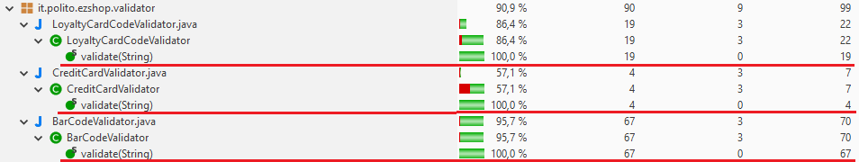
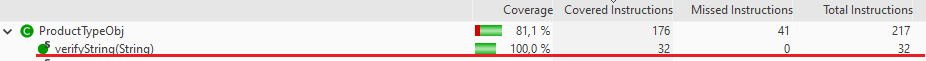
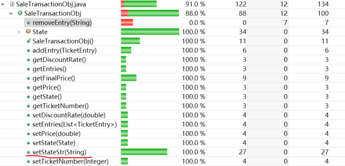
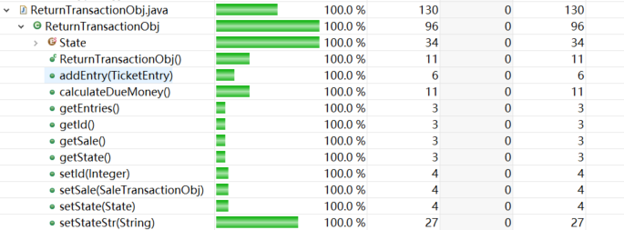

# Unit Testing Documentation template

Authors: Alessandro Versace, Alessandro Landra, Ivan Lombardi, Zhou Chenghan, 

Date: 19/5/2021

Version: V1.0


# Contents

- [Black Box Unit Tests](#black-box-unit-tests)
- [White Box Unit Tests](#white-box-unit-tests)


---


# Black Box Unit Tests

```
<Define here criteria, predicates and the combination of predicates for each function of each class.
Define test cases to cover all equivalence classes and boundary conditions.
In the table, report the description of the black box test case and the correspondence with the JUnit black box test case name/number>
```


### Method BalanceOperationObj.setBalanceId

**Criteria for method BalanceOperationObj.setBalanceId**

- content of input

**Predicates for method BalanceOperationObj.setBalanceId**

| Criterion        | Predicate |
| ---------------- | --------- |
| content of input | [-inf,0)  |
|                  | [0,inf]   |

 **Combination of predicates for method BalanceOperationObj.setBalanceId**

| content of input | Valid/Invalid | Description of the test case                           | JUnit test case                     |
| ---------------- | ------------- | ------------------------------------------------------ | ----------------------------------- |
| [-inf,0)         | invalid       | setBalanceId(-1223);<br />getBalanceId()==-1223;<br /> | testBanlanceOperationObjSetBalanced |
| [0,inf]          | valid         | setBalanceId(1223);<br />getBalanceId()==1223;<br />   |                                     |


### Method BalanceOperationObj.setDate

**Criteria for method BalanceOperationObj.setDate**

- get the same value with input


**Predicates for method BalanceOperationObj.setDate:**

| Criterion                     | Predicate |
| ----------------------------- | --------- |
| get the same value with input | yes       |
|                               | no        |

 **Combination of predicates for method BalanceOperationObj.setDate**

| get the same value with input | Valid/Invalid | Description of the test case                               | JUnit test case                 |
| ----------------------------- | ------------- | ---------------------------------------------------------- | ------------------------------- |
| yes                           | valid         | setDate(2007-4-12);<br />getDate()==2007-4-12;<br />->true | testBanlanceOperationObjSetDate |
| no                            | valid         | setDate(2007-4-12);<br />getDate()!=2007-4-12;<br />->true |                                 |


### Method BalanceOperationObj.setMoney

**Criteria for method BalanceOperationObj.setMoney**

- content of input

**Predicates for method BalanceOperationObj.setMoney**

| Criterion        | Predicate   |
| ---------------- | ----------- |
| content of input | [-inf, 0.0) |
|                  | [0.0, inf]  |

 **Combination of predicates for method BalanceOperationObj.setMoney**

| get the same value with input | Valid/Invalid | Description of the test case                     | JUnit test case                  |
| ----------------------------- | ------------- | ------------------------------------------------ | -------------------------------- |
| [-inf, 0.0)                   | invalid       | setMoney(-1.223);<br />getMoney()==-1.223;<br /> | testBanlanceOperationObjSetMoney |
| [0.0, inf]                    | valid         | setMoney(1.223);<br />getMoney()==1.223;<br />   |                                  |


### Method BalanceOperationObj.setType

**Criteria for method BalanceOperationObj.setType**

- availability of type string

**Predicates for method BalanceOperationObj.setType:**

| Criterion                   | Predicate |
| --------------------------- | --------- |
| availability of type string | CREDIT    |
|                             | DEBIT     |
|                             | others    |

 **Combination of predicates for method BalanceOperationObj.setType**

| availability of type string | Valid/Invalid | Description of the test case                             | JUnit test case                 |
| --------------------------- | ------------- | -------------------------------------------------------- | ------------------------------- |
| others                      | valid         | setType("qweqd");<br />getType()=="DEBIT";<br />->true   | testBanlanceOperationObjSetType |
| CREDIT                      | valid         | setType("CREDIT");<br />getType()=="CREDIT";<br />->true |                                 |
| DEBIT                       | valid         | setType("DEBIT");<br />getType()=="DEBIT";<br />->true   |                                 |


---


### Method CreditCardObj.setMoney

**Criteria for method CreditCardObj.setMoney**

- get the same value with input

**Predicates for method CreditCardObj.setMoney:**

| Criterion                     | Predicate |
| ----------------------------- | --------- |
| get the same value with input | yes       |
|                               | no        |

 **Combination of predicates for method CreditCardObj.setMoney**

| get the same value with input | Valid/Invalid | Description of the test case                         | JUnit test case           |
| ----------------------------- | ------------- | ---------------------------------------------------- | ------------------------- |
| yes                           | valid         | setMoney(1.223);<br />getMoney()==1.223;<br />->true | testCreditCardObjSetMoney |
| no                            | valid         | setMoney(1.223);<br />getMoney()!=1.223;<br />->true |                           |


---


### Method CustomerObj.setCustomerName

**Criteria for method CustomerObj.setCustomerName**

- content of input

**Predicates for method CustomerObj.setCustomerName**

| Criterion        | Predicate                         |
| ---------------- | --------------------------------- |
| content of input | 0-9, A-Z, a-z, special characters |
|                  | null                              |

 **Combination of predicates for method CustomerObj.setCustomerName**

| content of input                  | Valid/Invalid | Description of the test case                                 | JUnit test case                |
| --------------------------------- | ------------- | ------------------------------------------------------------ | ------------------------------ |
| 0-9, A-Z, a-z, special characters | valid         | setCustomerName("1.2231dsaas!@#");<br />getCustomerName()=="1.2231dsaas!@#";<br /> | testCustomerObjSetCustomerName |
| null                              | invalid       | setCustomerName();<br />getCustomerName()==not null;<br />   |                                |


### Method CustomerObj.setCustomerCard

**Criteria for method CustomerObj.setCustomerCard**

- content of input

**Predicates for method CustomerObj.setCustomerCard**

| Criterion        | Predicate                         |
| ---------------- | --------------------------------- |
| content of input | 0-9, A-Z, a-z, special characters |
|                  | null                              |

 **Combination of predicates for method CustomerObj.setCustomerCard**

| content of input                  | Valid/Invalid | Description of the test case                                 | JUnit test case                |
| --------------------------------- | ------------- | ------------------------------------------------------------ | ------------------------------ |
| 0-9, A-Z, a-z, special characters | valid         | setCustomerCard("1.2231dsaas!@#");<br />getCustomerCard()=="1.2231dsaas!@#";<br /> | testCustomerObjSetCustomerCard |
| null                              | invalid       | setCustomerCard();<br />getCustomerCard()==not null;<br />   |                                |


### Method CustomerObj.setId

**Criteria for method CustomerObj.setId**

- content of input

**Predicates for method CustomerObj.setId**

| Criterion        | Predicate |
| ---------------- | --------- |
| content of input | [-inf,0)  |
|                  | [0,inf]   |

 **Combination of predicates for method CustomerObj.setId**

| content of input | Valid/Invalid | Description of the test case             | JUnit test case      |
| ---------------- | ------------- | ---------------------------------------- | -------------------- |
| [-inf,0)         | invalid       | setId(-1223);<br />getId()==-1223;<br /> | testCustomerObjSetId |
| [0,inf]          | valid         | setId(1223);<br />getId()==1223;<br />   |                      |


### Method CustomerObj.setPoints

**Criteria for method CustomerObj.setPoints**

- content of input

**Predicates for method CustomerObj.setPoints**

| Criterion        | Predicate   |
| ---------------- | ----------- |
| content of input | [-inf, 0.0) |
|                  | [0.0, inf]  |

 **Combination of predicates for method CustomerObj.setPoints**

| get the same value with input | Valid/Invalid | Description of the test case                         | JUnit test case          |
| ----------------------------- | ------------- | ---------------------------------------------------- | ------------------------ |
| yes                           | valid         | setPoints(1223);<br />getPoints()==1223;<br />->true | testCustomerObjSetPoints |
| no                            | valid         | setPoints(1223);<br />getPoints()!=1223;<br />->true |                          |


---


### Method LoyaltyCard.setCardId

**Criteria for method LoyaltyCard.setCardId**

- content of input

**Predicates for method LoyaltyCard.setCardId**

| Criterion        | Predicate                         |
| ---------------- | --------------------------------- |
| content of input | 0-9, A-Z, a-z, special characters |
|                  | null                              |

 **Combination of predicates for method LoyaltyCard.setCardId**

| content of input                  | Valid/Invalid | Description of the test case                                 | JUnit test case          |
| --------------------------------- | ------------- | ------------------------------------------------------------ | ------------------------ |
| 0-9, A-Z, a-z, special characters | valid         | setCardId("1.2231dsaas!@#");<br />getCardId()=="1.2231dsaas!@#";<br /> | testLoyaltyCardSetCardId |
| null                              | invalid       | setCardId();<br />getCardId()==not null;<br />               |                          |


### Method LoyaltyCard.setPoints

**Criteria for method LoyaltyCard.setPoints**

- content of input

**Predicates for method LoyaltyCard.setPoints**

| Criterion        | Predicate |
| ---------------- | --------- |
| content of input | [-inf,0)  |
|                  | [0,inf]   |

 **Combination of predicates for method LoyaltyCard.setPoints**

| content of input | Valid/Invalid | Description of the test case                     | JUnit test case          |
| ---------------- | ------------- | ------------------------------------------------ | ------------------------ |
| [-inf,0)         | invalid       | setPoints(-1223);<br />getPoints()==-1223;<br /> | testLoyaltyCardSetPoints |
| [0,inf]          | valid         | setPoints(1223);<br />getPoints()==1223;<br />   |                          |


---


### Method OrderObj.setBalanceId

**Criteria for method OrderObj.setBalanceId**

- content of input

**Predicates for method OrderObj.setBalanceId**

| Criterion        | Predicate |
| ---------------- | --------- |
| content of input | [-inf,0)  |
|                  | [0,inf]   |

 **Combination of predicates for method OrderObj.setBalanceId**

| content of input | Valid/Invalid | Description of the test case                           | JUnit test case          |
| ---------------- | ------------- | ------------------------------------------------------ | ------------------------ |
| [-inf,0)         | invalid       | setBalanceId(-1223);<br />getBalanceId()==-1223;<br /> | testOrderObjSetBalanceId |
| [0,inf]          | valid         | setBalanceId(1223);<br />getBalanceId()==1223;<br />   |                          |


### Method OrderObj.setProductCode

**Criteria for method OrderObj.setProductCode**

- content of input

**Predicates for method OrderObj.setProductCode**

| Criterion        | Predicate                         |
| ---------------- | --------------------------------- |
| content of input | 0-9, A-Z, a-z, special characters |
|                  | null                              |

 **Combination of predicates for method OrderObj.setProductCode**

| content of input                  | Valid/Invalid | Description of the test case                                 | JUnit test case            |
| --------------------------------- | ------------- | ------------------------------------------------------------ | -------------------------- |
| 0-9, A-Z, a-z, special characters | valid         | setProductCode("1.2231dsaas!@#");<br />getProductCode()=="1.2231dsaas!@#";<br /> | testOrderObjSetProductCode |
| null                              | invalid       | setProductCode();<br />getProductCode()==not null;<br />     |                            |


### Method OrderObj.setPricePerUnit

**Criteria for method OrderObj.setPricePerUnit**

- content of input

**Predicates for method OrderObj.setPricePerUnit**

| Criterion        | Predicate   |
| ---------------- | ----------- |
| content of input | [-inf, 0.0) |
|                  | [0.0, inf]  |

 **Combination of predicates for method OrderObj.setPricePerUnit**

| get the same value with input | Valid/Invalid | Description of the test case                                 | JUnit test case             |
| ----------------------------- | ------------- | ------------------------------------------------------------ | --------------------------- |
| [-inf, 0.0)                   | invalid       | setPricePerUnit(-1.223);<br />getPricePerUnit()==-1.223;<br /> | testOrderObjSetPricePerUnit |
| [0.0, inf]                    | valid         | setPricePerUnit(1.223);<br />getPricePerUnit()==1.223;<br /> |                             |


### Method OrderObj.setQuantity

**Criteria for method OrderObj.setQuantity**

- content of input

**Predicates for method OrderObj.setQuantity**

| Criterion        | Predicate |
| ---------------- | --------- |
| content of input | [-inf,0)  |
|                  | [0,inf]   |

 **Combination of predicates for method OrderObj.setQuantity**

| content of input | Valid/Invalid | Description of the test case                         | JUnit test case         |
| ---------------- | ------------- | ---------------------------------------------------- | ----------------------- |
| [-inf,0)         | invalid       | setQuantity(-1223);<br />getQuantity()==-1223;<br /> | testOrderObjSetQuantity |
| [0,inf]          | valid         | setQuantity(1223);<br />getQuantity()==1223;<br />   |                         |


### Method OrderObj.setStatus

**Criteria for method LoyaltyCard.setStatus**

- content of status

**Predicates for method LoyaltyCard.setStatus**

| Criterion         | Predicate |
| ----------------- | --------- |
| content of status | payed     |
|                   | completed |
|                   | issued    |
|                   | others    |

 **Combination of predicates for method OrderObj.setStatus**

| content of status | Valid/Invalid | Description of the test case                                 | JUnit test case       |
| ----------------- | ------------- | ------------------------------------------------------------ | --------------------- |
| payed             | valid         | setStatus("payed");<br />getStatus()=="payed";<br />         | testOrderObjSetStatus |
| completed         | valid         | setStatus("completed");<br />getStatus()=="completed";<br /> |                       |
| issued            | valid         | setStatus("issued");<br />getStatus()=="issued";<br />       |                       |
| others            | invalid       | setStatus("iqnwiqdun12");<br />getStatus()=="issued";<br />  |                       |


### Method OrderObj.setOrderId

**Criteria for method LoyaltyCard.setOrderId**

- availability of orderID

**Predicates for method LoyaltyCard.setOrderId**

| Criterion               | Predicate |
| ----------------------- | --------- |
| availability of orderID | [-inf, 0) |
|                         | [0, inf]  |

 **Combination of predicates for method OrderObj.setOrderId**

| availability of orderID | Valid/Invalid | Description of the test case                     | JUnit test case        |
| ----------------------- | ------------- | ------------------------------------------------ | ---------------------- |
| [0, inf]                | valid         | setOrderId(1223);<br />getOrderId()==1223;<br /> | testOrderObjSetOrderId |
| [-inf, 0)               | invalid       | setOrderId(-123);<br />getOrderId()==-123;<br /> |                        |


---


### Method ProductTypeObj.setQuantity

**Criteria for method ProductTypeObj.setQuantity**

- content of input

**Predicates for method ProductTypeObj.setQuantity**

| Criterion        | Predicate |
| ---------------- | --------- |
| content of input | [-inf,0)  |
|                  | [0,inf]   |

 **Combination of predicates for method ProductTypeObj.setQuantity**

| content of input | Valid/Invalid | Description of the test case                         | JUnit test case               |
| ---------------- | ------------- | ---------------------------------------------------- | ----------------------------- |
| [-inf,0)         | invalid       | setQuantity(-1223);<br />getQuantity()==-1223;<br /> | testProductTypeObjSetQuantity |
| [0,inf]          | valid         | setQuantity(1223);<br />getQuantity()==1223;<br />   |                               |


### Method ProductTypeObj.setLocation

**Criteria for method ProductTypeObj.setLocation**

- content of input

**Predicates for method ProductTypeObj.setLocation**

| Criterion        | Predicate                         |
| ---------------- | --------------------------------- |
| content of input | 0-9, A-Z, a-z, special characters |
|                  | null                              |

 **Combination of predicates for method ProductTypeObj.setLocation**

| content of input                  | Valid/Invalid | Description of the test case                                 | JUnit test case               |
| --------------------------------- | ------------- | ------------------------------------------------------------ | ----------------------------- |
| 0-9, A-Z, a-z, special characters | valid         | setLocation("1.2231dsaas!@#");<br />getLocation()=="1.2231dsaas!@#";<br /> | testProductTypeObjSetLocation |
| null                              | invalid       | setLocation();<br />getLocation()==not null;<br />           |                               |


### Method ProductTypeObj.setNote

**Criteria for method ProductTypeObj.setNote**

- content of input

**Predicates for method ProductTypeObj.setNote**

| Criterion        | Predicate                         |
| ---------------- | --------------------------------- |
| content of input | 0-9, A-Z, a-z, special characters |
|                  | null                              |

 **Combination of predicates for method ProductTypeObj.setNote**

| content of input                  | Valid/Invalid | Description of the test case                                 | JUnit test case           |
| --------------------------------- | ------------- | ------------------------------------------------------------ | ------------------------- |
| 0-9, A-Z, a-z, special characters | valid         | setNote("1.2231dsaas!@#");<br />getNote()=="1.2231dsaas!@#";<br /> | testProductTypeObjSetNote |
| null                              | invalid       | setNote();<br />getNote()==not null;<br />                   |                           |


### Method ProductTypeObj.setProductDescription

**Criteria for method ProductTypeObj.setProductDescription**

- content of input

**Predicates for method ProductTypeObj.setProductDescription**

| Criterion        | Predicate                         |
| ---------------- | --------------------------------- |
| content of input | 0-9, A-Z, a-z, special characters |
|                  | null                              |

 **Combination of predicates for method ProductTypeObj.setProductDescription**

| content of input                  | Valid/Invalid | Description of the test case                                 | JUnit test case                         |
| --------------------------------- | ------------- | ------------------------------------------------------------ | --------------------------------------- |
| 0-9, A-Z, a-z, special characters | valid         | setProductDescription("1.2231dsaas!@#");<br />getProductDescription()=="1.2231dsaas!@#";<br /> | testProductTypeObjSetProductDescription |
| null                              | invalid       | setProductDescription();<br />getProductDescription()==not null;<br /> |                                         |


### Method ProductTypeObj.setBarCode

**Criteria for method ProductTypeObj.setBarCode**

- content of input

**Predicates for method ProductTypeObj.setBarCode**

| Criterion        | Predicate                         |
| ---------------- | --------------------------------- |
| content of input | 0-9, A-Z, a-z, special characters |
|                  | null                              |

 **Combination of predicates for method ProductTypeObj.setBarCode**

| content of input                  | Valid/Invalid | Description of the test case                                 | JUnit test case              |
| --------------------------------- | ------------- | ------------------------------------------------------------ | ---------------------------- |
| 0-9, A-Z, a-z, special characters | valid         | setBarCode("1.2231dsaas!@#");<br />getBarCode()=="1.2231dsaas!@#";<br /> | testProductTypeObjSetBarCode |
| null                              | invalid       | setBarCode();<br />getBarCode()==not null;<br />             |                              |


### Method ProductTypeObj.setPricePerUnit

**Criteria for method LoyaltyCard.setPricePerUnit**

- content of input

**Predicates for method LoyaltyCard.setPricePerUnit**

| Criterion        | Predicate   |
| ---------------- | ----------- |
| content of input | [-inf, 0.0) |
|                  | [0.0, inf]  |

 **Combination of predicates for method LoyaltyCard.setPricePerUnit**

| get the same value with input | Valid/Invalid | Description of the test case                                 | JUnit test case                   |
| ----------------------------- | ------------- | ------------------------------------------------------------ | --------------------------------- |
| [-inf, 0.0)                   | valid         | setPricePerUnit(-1.223);<br />getPricePerUnit()==-1.223;<br /> | testProductTypeObjSetPricePerUnit |
| [0.0, inf]                    | valid         | setPricePerUnit(1.223);<br />getPricePerUnit()==1.223;<br /> |                                   |


### Method ProductTypeObj.setId

**Criteria for method ProductTypeObj.setId**

- content of input

**Predicates for method ProductTypeObj.setId**

| Criterion        | Predicate |
| ---------------- | --------- |
| content of input | [-inf,0)  |
|                  | [0,inf]   |

 **Combination of predicates for method ProductTypeObj.setId**

| content of input | Valid/Invalid | Description of the test case             | JUnit test case         |
| ---------------- | ------------- | ---------------------------------------- | ----------------------- |
| [-inf,0)         | invalid       | setId(-1223);<br />getId()==-1223;<br /> | testProductTypeObjSetId |
| [0,inf]          | valid         | setId(1223);<br />getId()==1223;<br />   |                         |


### Method ProductTypeObj.verifyString

**Criteria for method ProductTypeObj.verifyString:**

+ number of parts of position
+ first part length
+ first part characters  
+ second part length
+ second part characters  
+ third part characters

**Predicates for method ProductTypeObj.verifyString:**

| Criterion                   | Predicate           |
| --------------------------- | ------------------- |
| number of parts of position | =3                  |
|                             | <3                  |
|                             | >3                  |
| first part length           | =3                  |
|                             | <3                  |
|                             | >3                  |
| first part characters       | 0-9                 |
|                             | 'a'-'z' and 'A'-'Z' |
|                             | special characters  |
| second part length          | 0                   |
|                             | >=1                 |
| second part characters      | 0-9                 |
|                             | 'a'-'z' and 'A'-'Z' |
|                             | special characters  |
| third part characters       | 0-9                 |
|                             | 'a'-'z' and 'A'-'Z' |
|                             | special characters  |

 **Combination of predicates for method ProductTypeObj.verifyString**

| number of parts of position | first part length | first part characters | second part length | second part characters | third part characters | Valid/Invalid | Description of the test case                  | JUnit test case                |
| --------------------------- | ----------------- | --------------------- | ------------------ | ---------------------- | --------------------- | ------------- | --------------------------------------------- | ------------------------------ |
| >3                          | *                 | *                     | *                  | *                      | *                     | valid         | verifyString(“12-d“)<br />->false             | testProductTypeObjVerifyString |
| <3                          | *                 | *                     | *                  | *                      | *                     | valid         | verifyString(“12-d-e1ad-dqw“)<br />->false    |                                |
| *                           | >3                | *                     | *                  | *                      | *                     | valid         | verifyString(“121231-d-e1ad“)<br />->false    |                                |
| *                           | <3                | *                     | *                  | *                      | *                     | valid         | verifyString(“12-ddiqn-213124“)<br />->false  |                                |
| *                           | *                 | 'a'-'z' and 'A'-'Z'   | *                  | *                      | *                     | valid         | verifyString(“asd-ddiqn-213124“)<br />->false |                                |
| *                           | *                 | special characters    | *                  | *                      | *                     | valid         | verifyString(“!@3-ddiqn-213124“)<br />->false |                                |
| *                           | *                 | *                     | 0                  | *                      | *                     | valid         | verifyString(“123--213124“)<br />->false      |                                |
| *                           | *                 | *                     | *                  | 0-9                    | *                     | valid         | verifyString(“123-123d-213124“)<br />->false  |                                |
| *                           | *                 | *                     | *                  | special characters     | *                     | valid         | verifyString(“123-d!@#-213124“)<br />->false  |                                |
| *                           | *                 | *                     | *                  | *                      | 'a'-'z' and 'A'-'Z'   | valid         | verifyString(“123-ddiqn-123asd“)<br />->false |                                |
| *                           | *                 | *                     | *                  | *                      | special characters    | valid         | verifyString(“123-ddiqn-!@$123“)<br />->false |                                |
| =3                          | =3                | 0-9                   | >=1                | 'a'-'z' and 'A'-'Z'    | 0-9                   | valid         | verifyString(“123-ddiqn-213124“)<br />->true  |                                |


### Method ProductTypeObj.searchProductByBarCode

**Criteria for method ProductTypeObj.searchProductByBarCode:**

+ existence of barcode in location map

**Predicates for method ProductTypeObj.searchProductByBarCode:**

| Criterion                            | Predicate |
| ------------------------------------ | --------- |
| existence of barcode in location map | yes       |
|                                      | no        |

 **Combination of predicates for method ProductTypeObj.searchProductByBarCode**

| existence of barcode in location map | Valid/Invalid | Description of the test case                                | JUnit test case                          |
| ------------------------------------ | ------------- | ----------------------------------------------------------- | ---------------------------------------- |
| yes                                  | valid         | searchProductByBarCode(inventoryMap, barcode)->product name | testProductTypeObjSearchProductByBarCode |
| no                                   | valid         | searchProductByBarCode(inventoryMap, barcode)->Null         |                                          |


### Method ProductTypeObj.searchProductDescription

**Criteria for method ProductTypeObj.searchProductDescription:**

+ existence of description in location map

**Predicates for method ProductTypeObj.searchProductDescription:**

| Criterion                                | Predicate |
| ---------------------------------------- | --------- |
| existence of description in location map | yes       |
|                                          | no        |

 **Combination of predicates for method ProductTypeObj.searchProductDescription**

| existence of description in location map | Valid/Invalid | Description of the test case                                 | JUnit test case                              |
| ---------------------------------------- | ------------- | ------------------------------------------------------------ | -------------------------------------------- |
| yes                                      | valid         | searchProductDescription(inventoryMap, description)->list of related products | testProductTypeObjSearchProductByDescription |
| no                                       | valid         | searchProductDescription(inventoryMap, description)->no target contains in it |                                              |


### Method ProductTypeObj.verifyPosition

**Criteria for method ProductTypeObj.verifyPosition:**

+ existence of p in location map

**Predicates for method ProductTypeObj.verifyPosition:**

| Criterion                      | Predicate |
| ------------------------------ | --------- |
| existence of p in location map | yes       |
|                                | no        |

 **Combination of predicates for method ProductTypeObj.verifyPosition**

| existence of p in location map | Valid/Invalid | Description of the test case | JUnit test case                  |
| ------------------------------ | ------------- | ---------------------------- | -------------------------------- |
| yes                            | valid         | ->true                       | testProductTypeObjVerifyPosition |
| no                             | valid         | ->false                      |                                  |


---


### Method SaleTransactionObj.setState

**Criteria for method SaleTransactionObj.setState**

- content of input

**Predicates for method SaleTransactionObj.setState**

| Criterion        | Predicate |
| ---------------- | --------- |
| content of input | open      |
|                  | closed    |
|                  | payed     |

 **Combination of predicates for method SaleTransactionObj.setState**

| content of input | Valid/Invalid | Description of the test case                       | JUnit test case                |
| ---------------- | ------------- | -------------------------------------------------- | ------------------------------ |
| open             | valid         | setState("open");<br />getState()=="open";<br />   | testSaleTransactionObjSetState |
| close            | valid         | setState("close");<br />getState()=="close";<br /> |                                |
| payed            | valid         | setState("payed");<br />getState()=="open";<br />  |                                |


### Method SaleTransactionObj.setTicketNumber

**Criteria for method SaleTransactionObj.setTicketNumber**

- content of input

**Predicates for method SaleTransactionObj.setTicketNumber**

| Criterion        | Predicate |
| ---------------- | --------- |
| content of input | [-inf,0)  |
|                  | [0,inf]   |

 **Combination of predicates for method SaleTransactionObj.setTicketNumber**

| content of input | Valid/Invalid | Description of the test case                                 | JUnit test case                       |
| ---------------- | ------------- | ------------------------------------------------------------ | ------------------------------------- |
| [-inf,0)         | invalid       | setTicketNumber(-1223);<br />getTicketNumber()==-1223;<br /> | testSaleTransactionObjSetTicketNumber |
| [0,inf]          | valid         | setTicketNumber(1223);<br />getTicketNumber()==1223;<br />   |                                       |


### Method SaleTransactionObj.setEntries

**Criteria for method SaleTransactionObj.setEntries**

- availability of input entry

**Predicates for method SaleTransactionObj.setEntries**

| Criterion                   | Predicate |
| --------------------------- | --------- |
| availability of input entry | yes       |
|                             | no        |

 **Combination of predicates for method SaleTransactionObj.setEntries**

| availability of input entry | Valid/Invalid | Description of the test case          | JUnit test case                  |
| --------------------------- | ------------- | ------------------------------------- | -------------------------------- |
| yes                         | valid         | setEntries(lst);<br />getEntries==lst | testSaleTransactionObjSetEntries |
| no                          | invalid       | setEntries(lst);<br />getEntries!=lst |                                  |


### Method SaleTransactionObj.setDiscountRate

**Criteria for method SaleTransactionObj.setDiscountRate**

- range of input

**Predicates for method SaleTransactionObj.setDiscountRate**

| Criterion      | Predicate   |
| -------------- | ----------- |
| range of input | [-inf, 0.0) |
|                | [0.0, 1.0]  |
|                | (1.0, inf)  |

 **Combination of predicates for method SaleTransactionObj.setDiscountRate**

| get the same value with input | Valid/Invalid | Description of the test case                                 | JUnit test case                       |
| ----------------------------- | ------------- | ------------------------------------------------------------ | ------------------------------------- |
| [-inf, 0.0)                   | invalid       | setDiscountRate(-1.223);<br />getDiscountRate()==-1.223;<br /> | testSaleTransactionObjSetDiscountRate |
| [0.0, 1.0]                    | valid         | setDiscountRate(0.223);<br />getDiscountRate()==0.223;<br /> |                                       |
| (1.0, inf)                    | invalid       | setDiscountRate(1.223);<br />getDiscountRate()==1.223;<br /> |                                       |


### Method SaleTransactionObj.setPrice

**Criteria for method SaleTransactionObj.setPrice**

- content of input

**Predicates for method SaleTransactionObj.setPrice**

| Criterion        | Predicate   |
| ---------------- | ----------- |
| content of input | [-inf, 0.0) |
|                  | [0.0, inf]  |

 **Combination of predicates for method SaleTransactionObj.setPrice**

| get the same value with input | Valid/Invalid | Description of the test case                     | JUnit test case                |
| ----------------------------- | ------------- | ------------------------------------------------ | ------------------------------ |
| [-inf, 0.0)                   | valid         | setPrice(-1.223);<br />getPrice()==-1.223;<br /> | testSaleTransactionObjSetPrice |
| [0.0, inf]                    | valid         | setPrice(1.223);<br />getPrice()==1.223;<br />   |                                |


---


### Method TicketEntryObj.setBarCode

**Criteria for method TicketEntryObj.setBarCode**

- content of input

**Predicates for method TicketEntryObj.setBarCode**

| Criterion        | Predicate                         |
| ---------------- | --------------------------------- |
| content of input | 0-9, A-Z, a-z, special characters |
|                  | null                              |

 **Combination of predicates for method TicketEntryObj.setBarCode**

| content of input                  | Valid/Invalid | Description of the test case                                 | JUnit test case              |
| --------------------------------- | ------------- | ------------------------------------------------------------ | ---------------------------- |
| 0-9, A-Z, a-z, special characters | valid         | setBarCode("1.2231dsaas!@#");<br />getBarCode()=="1.2231dsaas!@#";<br /> | testTickeyEntryObjsetBarCode |
| null                              | invalid       | setBarCode();<br />getBarCode()==not null;<br />             |                              |


### Method TicketEntryObj.setProductDescription

**Criteria for method TicketEntryObj.setProductDescription**

- content of input

**Predicates for method TicketEntryObj.setProductDescription**

| Criterion        | Predicate                         |
| ---------------- | --------------------------------- |
| content of input | 0-9, A-Z, a-z, special characters |
|                  | null                              |

 **Combination of predicates for method TicketEntryObj.setProductDescription**

| content of input                  | Valid/Invalid | Description of the test case                                 | JUnit test case                         |
| --------------------------------- | ------------- | ------------------------------------------------------------ | --------------------------------------- |
| 0-9, A-Z, a-z, special characters | valid         | setProductDescription("1.2231dsaas!@#");<br />getProductDescription()=="1.2231dsaas!@#";<br /> | testTickeyEntryObjsetProductDescription |
| null                              | invalid       | setProductDescription();<br />getProductDescription()==not null;<br /> |                                         |


### Method TicketEntryObj.setAmount

**Criteria for method TicketEntryObj.setAmount**

- content of input

**Predicates for method TicketEntryObj.setAmount**

| Criterion        | Predicate |
| ---------------- | --------- |
| content of input | [-inf,0)  |
|                  | [0,inf]   |

 **Combination of predicates for method TicketEntryObj.setAmount**

| content of input | Valid/Invalid | Description of the test case                     | JUnit test case             |
| ---------------- | ------------- | ------------------------------------------------ | --------------------------- |
| [-inf,0)         | invalid       | setAmount(-1223);<br />getAmount()==-1223;<br /> | testTickeyEntryObjsetAmount |
| [0,inf]          | valid         | setAmount(1223);<br />getAmount()==1223;<br />   |                             |


### Method TicketEntryObj.setPricePerUnit

**Criteria for method TicketEntryObj.setPricePerUnit**

- content of input

**Predicates for method TicketEntryObj.setPricePerUnit**

| Criterion        | Predicate   |
| ---------------- | ----------- |
| content of input | [-inf, 0.0) |
|                  | [0.0, inf]  |

 **Combination of predicates for method TicketEntryObj.setPricePerUnit**

| get the same value with input | Valid/Invalid | Description of the test case                                 | JUnit test case                   |
| ----------------------------- | ------------- | ------------------------------------------------------------ | --------------------------------- |
| [-inf, 0.0)                   | valid         | setPricePerUnit(-1.223);<br />getPricePerUnit()==-1.223;<br /> | testTickeyEntryObjsetPricePerUnit |
| [0.0, inf]                    | valid         | setPricePerUnit(1.223);<br />getPricePerUnit()==1.223;<br /> |                                   |


### Method TicketEntryObj.setDiscountRate

**Criteria for method TicketEntryObj.setDiscountRate**

- content of input

**Predicates for method TicketEntryObj.setDiscountRate**

| Criterion        | Predicate   |
| ---------------- | ----------- |
| content of input | [-inf, 0.0) |
|                  | [0.0, inf]  |

 **Combination of predicates for method TicketEntryObj.setDiscountRate**

| get the same value with input | Valid/Invalid | Description of the test case                                 | JUnit test case                   |
| ----------------------------- | ------------- | ------------------------------------------------------------ | --------------------------------- |
| [-inf, 0.0)                   | valid         | setDiscountRate(-1.223);<br />getDiscountRate()==-1.223;<br /> | testTickeyEntryObjsetDiscountRate |
| [0.0, inf]                    | valid         | setDiscountRate(1.223);<br />getDiscountRate()==1.223;<br /> |                                   |


---


### Method UserObj.setId

**Criteria for method UserObj.setId**

- content of input

**Predicates for method UserObj.setId**

| Criterion        | Predicate |
| ---------------- | --------- |
| content of input | [-inf,0)  |
|                  | [0,inf]   |

 **Combination of predicates for method UserObj.setId**

| content of input | Valid/Invalid | Description of the test case             | JUnit test case  |
| ---------------- | ------------- | ---------------------------------------- | ---------------- |
| [-inf,0)         | invalid       | setId(-1223);<br />getId()==-1223;<br /> | testUserObjsetId |
| [0,inf]          | valid         | setId(1223);<br />getId()==1223;<br />   |                  |


### Method UserObj.setUsername

**Criteria for method UserObj.setUsername**

- content of input

**Predicates for method UserObj.setUsername**

| Criterion        | Predicate                         |
| ---------------- | --------------------------------- |
| content of input | 0-9, A-Z, a-z, special characters |
|                  | null                              |

 **Combination of predicates for method UserObj.setUsername**

| content of input                  | Valid/Invalid | Description of the test case                                 | JUnit test case           |
| --------------------------------- | ------------- | ------------------------------------------------------------ | ------------------------- |
| 0-9, A-Z, a-z, special characters | valid         | setUsername("1.2231dsaas!@#");<br />getUsername()=="1.2231dsaas!@#";<br /> | testUserObjVerifyUsername |
| null                              | invalid       | setUsername();<br />getUsername()==not null;<br />           |                           |


### Method UserObj.setPassword

**Criteria for method UserObj.setPassword**

- content of input

**Predicates for method UserObj.setPassword**

| Criterion        | Predicate                         |
| ---------------- | --------------------------------- |
| content of input | 0-9, A-Z, a-z, special characters |
|                  | null                              |

 **Combination of predicates for method UserObj.setPassword**

| content of input                  | Valid/Invalid | Description of the test case                                 | JUnit test case        |
| --------------------------------- | ------------- | ------------------------------------------------------------ | ---------------------- |
| 0-9, A-Z, a-z, special characters | valid         | setPassword("1.2231dsaas!@#");<br />getPassword()=="1.2231dsaas!@#";<br /> | testUserObjsetPassword |
| null                              | invalid       | setPassword();<br />getPassword()==not null;<br />           |                        |


### Method UserObj.setRole

**Criteria for method UserObj.setRole**

- content of input

**Predicates for method UserObj.setRole**

| Criterion        | Predicate                         |
| ---------------- | --------------------------------- |
| content of input | 0-9, A-Z, a-z, special characters |
|                  | null                              |

 **Combination of predicates for method UserObj.setRole**

| content of input                  | Valid/Invalid | Description of the test case                                 | JUnit test case    |
| --------------------------------- | ------------- | ------------------------------------------------------------ | ------------------ |
| 0-9, A-Z, a-z, special characters | valid         | setRole("1.2231dsaas!@#");<br />getRole()=="1.2231dsaas!@#";<br /> | testUserObjsetRole |
| null                              | invalid       | setRole();<br />getRole()==not null;<br />                   |                    |


### Method UserObj.verifyUsername


**Criteria for method UserObj.verifyUsername:**

+ existence of user name in tree map

**Predicates for method UserObj.verifyUsername:**

| Criterion                          | Predicate |
| ---------------------------------- | --------- |
| existence of user name in tree map | exist     |
|                                    | not exist |

 **Combination of predicates for method UserObj.verifyUsername**

| existence of user name in tree map | Valid/Invalid | Description of the test case                                 | JUnit test case           |
| ---------------------------------- | ------------- | ------------------------------------------------------------ | ------------------------- |
| exist                              | valid         | users.username="abc123"<br />verifyUsername(users, "abc123")<br />->true | testUserObjVerifyUsername |
| not exist                          | valid         | users.username="abc123"<br />verifyUsername(users, "dqw124")<br />->false |                           |


---


### Method BarCodeValidator.validate


**Criteria for method validate:**

+ length of bar code
+ characters of bar code

**Predicates for method BarCodeValidator.validate:**

| Criterion              | Predicate          |
| ---------------------- | ------------------ |
| length of bar code     | <12                |
|                        | >=12 and <=14      |
|                        | >14                |
| characters of bar code | 0-9                |
|                        | a-z and A-Z        |
|                        | special characters |

 **Combination of predicates for method BarCodeValidator.validate**

| length of bar code | characters of bar code | Valid/Invalid | Description of the test case                | JUnit test case              |
| ------------------ | ---------------------- | ------------- | ------------------------------------------- | ---------------------------- |
| <12                | *                      | invalid       | validate("123123123")<br />->false          | testBarCodeValidatorValidate |
| >14                | *                      | invalid       | validate("123123123123123123")<br />->false |                              |
| *                  | a-z and A-Z            | invalid       | validate("1231ascac232")<br />->false       |                              |
| *                  | special characters     | invalid       | validate("1231!@$!1231")<br />->false       |                              |
| [12, 14]           | 0-9                    | valid         | validate("123123123123")<br />->true        |                              |


---


### Method LoyaltyCardCodeValidator.validate

**Criteria for method LoyaltyCardCodeValidaor.validate:**

+ length of loyaltyCardCode

**Predicates for method LoyaltyCardCodeValidator.validate:**

| Criterion                 | Predicate |
| ------------------------- | --------- |
| length of loyaltyCardCode | <10       |
|                           | 10        |
|                           | >10       |

 **Combination of predicates for method LoyaltyCardCodeValidator.validate**

| length of loyaltyCardCode | Valid/Invalid | Description of the test case         | JUnit test case                      |
| ------------------------- | ------------- | ------------------------------------ | ------------------------------------ |
| <10                       | valid         | validate("123")<br />->false         | testLoyaltyCardCodeValidatorValidate |
| >10                       | valid         | validate("12345678901")<br />->false |                                      |
| 10                        | valid         | validate("1234567890")<br />->true   |                                      |


# White Box Unit Tests

### Test cases definition

```plaintext
<JUnit test classes must be in src/test/java/it/polito/ezshop>
<Report here all the created JUnit test cases, and the units/classes under test >
<For traceability write the class and method name that contains the test case>
```

| Unit name                         | JUnit test case                      |
| --------------------------------- | ------------------------------------ |
| ReturnTransactionObj.setStateStr  | testReturnTransactionObjSetStateStr  |
| SaleTransactionObj.setStateStr    | testSaleTransactionObjSetStateStr    |
| BarCodeValidator.validate         | testBarCodeValidatorValidate         |
| LoyaltyCardCodeValidator.validate | testLoyaltyCardCodeValidatorValidate |
| CreditCardValidator.validate      | testCreditCardValidatorValidate      |
| ProductTypeObj.verifyString       | testProductTypeObjVerifyString        |

### Code coverage report

```plaintext
<Add here the screenshot report of the statement and branch coverage obtained using
the Eclemma tool. >
```

<center></img></center>

<center></img></center>

<center></img></center>

<center></img></center>

### Loop coverage analysis

```plaintext
<Identify significant loops in the units and reports the test cases
developed to cover zero, one or multiple iterations >
```

| Unit name            | Loop rows | Number of iterations | JUnit test case           |
| -------------------- | --------- | -------------------- | ------------------------- |
| UserObj.verifyname   | 2         | users.values()       | testUserObjVerifyUsername |
| LoyaltyCard.generate | 2         | 10                   | testModifyCustomer        |
